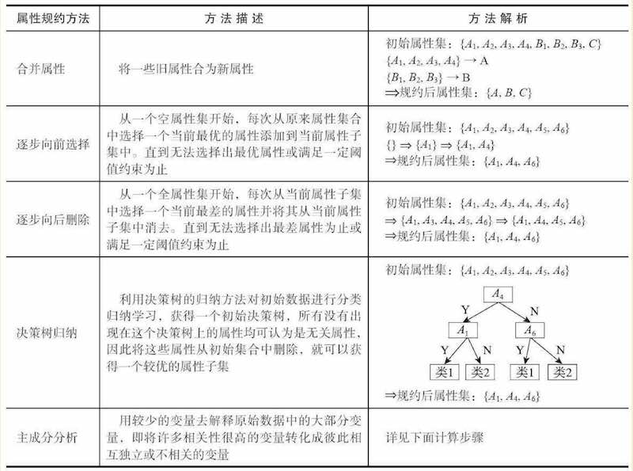

# 数据科学项目：方法概述

> 参考书籍《[Python 数据分析与挖掘实战](https://www.amazon.cn/dp/B019840NNC/)》章节1-5

## 1. 项目过程

例子：餐饮项目为例

## 2. 访谈、调研、及目标定义:

* 动态菜品智能推荐
* 餐饮客户细分（不同客户的贡献度和消费特征）
* 菜品销量进行趋势预测
* 新店选址优化（新店位置潜在顾客口味偏好）

## 3. 数据采集: 

希望完整无缺，指标项齐全，反映的是正常（不是异常）状态下的指标

* 抽样方法：(1) 随机（2）等距（3）分层抽样（4）从启始顺序抽样（5）分类抽样
* 数据来源：(1) 客户关系管理系统 (2) 前厅管理系统 (3) 后厨管理系统 (4) 财务管理系统和物资管理系统
* 数据内容：

	> 餐饮企业信息：名称、位置、规模、联系方式，以及部门、人员、角色等。 
	> 餐饮客户信息：姓名、联系方式、消费时间、消费金额等。 
	> 餐饮企业菜品信息：菜品名称、菜品单价、菜品成本、所属部门等。 
	> 菜品销量数据：菜品名称、销售日期、销售金额、销售份数。 
	> 原材料供应商资料及商品数据：供应商姓名、联系方式、商品名称、客户评价信息。 
	> 促销活动数据：促销日期、促销内容、促销描述。 
	> 外部数据，如天气、节假日、竞争对手以及周边商业氛围等。 

## 4. 数据探索：

异常值分析、缺失值分析、相关分析和周期性分析等 

### (1) 数据质量分析

#### 脏数据： 

	缺失值、异常值、不一致的值、重复数据及含有特殊符号（如#、￥、*）的数据

#### 缺失值处理：

步骤：  

	1. 统计有缺失值的属性的个数，每个属性的未缺失数、缺失数与缺失率
	2. 处理方法：（1）删除存在缺失值的记录；(2) 对可能值进行插补；（3）不处理

数据插补方法：

	1. 均值、中位数、众数插补
	2. 使用固定值插补
	3. 最邻近样本值插补
	4. 回归方法：根据已有数据和与其有关的其他变量（因变量）的数据建立拟合模型来预测缺失的属性值
	5. 差值：利用已知点建立合适的差值函数f(x)，未知点由对应的x计算得到f(x)值近似替代

拉格朗日插值法：

	原理：平面上n个点可以用n-1次多项式拟合、将缺失值的x坐标带入这个多项式可以近似估算对应的y值
	缺点：节点增减会导致多项式变化
	应用举例：餐厅销售数据（时间为x、销售额为y）可以使用拉格朗日插值法来填充缺失数据

> 代码：[4-1 用拉格朗日法进行插补](code/4-1_lagrange_newton_interp.py)； 数据：[data/catering_sale.xls](catering_sale.xls)

牛顿差值法：

	原理：通过连立n个点对(x1,y1),...,(xn,yn)的阶差商得到多项式，用于近似估算x对应的y值
	优点：承袭于拉格朗日插值法、同时又易于变动节点；另外拉格朗日插值与牛顿差值本质上来说给出的结果是一样的只是表现形式不同、因此scipy库只提供了拉格朗日插值法

#### 异常值分析（离群点分析）：

识别异常值：

	1. 统计量分析：剔除不符合常理的数据（如年龄199岁）
	2. 正态分布数据3σ原则：测定值与平均值的偏差超过3倍标准差（3σ）的值为小概率事件（ P(|x-μ|>3σ）≤ 0.003）
	3. 箱形图分析：两个4分位之间的数据占了样本的50%，异常值定义为`上四分位+1.5倍四分位间距`以上、或`下四分位-1.5倍四分位间距`以下的样本

代码：[3-1 餐饮销额数据异常值检测代码](code/3-1_abnormal_check.py)

异常值处理方法：

	1. 删除样本
	2. 视为缺失值来处理
	3. 用均值修正
	4. 不处理

#### 一致性分析：

	数据集成过程中，不同数据源提供的数据不一致（例如：电话号码在两个数据源中不同）

### (2) 数据特征分析

#### 分布分析

	定量数据（如销量）：频率分布表、频率分布直方图、茎叶图 
	定型数据（如菜品）：饼图、条形图 

#### 对比分析

	绝对数比较
	相对数比较：结构相对数（如产品合格率）；比例相对数（如性格比例）；比较相对数（如同时期不同地域销量）；强度相对数（如人均生产总值）；计划完成度相对数；动态相对数（如增速）

#### 统计量分析： 集中趋势度量

	均值：全局均值；加权均值；频率分布表（组段中值基于组段频率的加权平均）
	中位数：
	众数：离散变量中出现最频繁的值

#### 统计量分析：离中趋势度量

	极差＝最大值－最小值
	标准差
	变异系数：标准差相对于均值的离中趋势，`CV = (s/avg) * 100%` (其中`s`是标准差、avg是均值）
	四分位数间距：越大说明变异程度越大、越小说明变异程度越小

[代码3-2 餐饮销量数据统计量分析代码](code/3-2_statistics_analyze.py)

#### 周期性分析：

	如用电量周期

#### 贡献度分析（帕累托分析：基于80/20法则）：

	如菜品对营业额的贡献

[代码3-3 菜品盈利帕累托图代码](code/3-3_dish_pareto.py)

#### 相关性分析：

	散点图
	Pearson相关系数：连续变量间的线性相关性分析，要求连续变量的取值服从正态分布
	Spearman秩相关系数：也叫做等级相关系数，用于(1)不服从正态分布的变量(2)分类变量(3)等级变量
	R2判定系数：

[代码3-4 餐饮销量数据相关性分析](code/3-4_correlation_analyze.py)

## 数据预处理：

数据筛选、数据变量转换、缺失值处理、坏数据处理、数据标准化、主成分分析、属性选择、数据规约等 

### (1) 数据清洗

* 缺失值处理、异常值处理

### (2) 数据集成

* 处理同名异义、处理异名同义、处理单位不统一
* 数据冗余：同一属性出现多次；两个属性大同小异

### (3) 数据变换

* 函数变换：例如某些数据呈现重尾分布等、需要进行函数变换

	> 典型的函数变换包括：平方、开方、取对数、差分运算

* 规范化：

  > 消除指标之间的量纲和取值范围差异的影响，需要进行标准化处理，将数据按照比例进行缩放，使之落入一个特定的区域，便于进行综合分析。如将工资收入属性值映射到[1，1]或者[0，1]内 
  > 对于基于距离的挖掘算法尤为重要 
  > 典型的规范化方法诸如: 
  > 
  > * 最小最大规范化
  > * 零均值规范化（均值为0、标准化为1）
  > * 小数定标规范化（移动小数点、让属性值映射到[-1,1])
  
  > 代码：[4-2 数据规范化原理演示](code/4-2_data_normalization.py)

* 连续属性离散化：

  > 特别是某些分类算法（如ID3算法、Apriori算法等），要求数据是分类属性形式。这样，常常需要将连续属性变换成分类属性，即连续属性离散化 
  > 方法包括：(1)等宽法；（2）等频法；（3）一维聚类离散化（连续值用聚类方法聚类、用簇ID替换连续值） 
  > 代码：[4-3 连续属性离散化](code/4-3_data_discretization.py)； 数据: [data/discretization_data.xls](data/discretization_data.xls)

* 属性构造：利用已有特征、构造新特征

  > 代码：[4-4 构造线损率特征（线损率=供入电量-供出电量）](code/4-4_line_rate_construct.py)

* 小波变换特征提取（信号处理、图像处理、语音处理、模式识别、量子物理等领域应用越来越广泛）

  > 代码：[4-5 小波变换特征提取](code/4-5_wave_analyze.py)

### (4) 数据规约

**用途：**产生更小但保持原数据完整性的新数据集
 
> * 降低无效、错误数据对建模的影响，提高建模的准确性
> * 少量且具代表性的数据将大幅缩减数据挖掘所需的时间
> * 降低储存数据的成本

#### 属性规约： 

> 通过属性合并、或者删除不相关的属性来减少数据维数，目标是寻找出最小的属性子集并确保新数据子集的概率分布尽可能地接近原来数据集的概率分布

方法： 

代码：[4-6 主成分分析降维代码](4-6_principal_component_analyze.py) 

#### 数值规约：

通过选择替代的、较小的数据来减少数据量，包括有参数方法和无参数方法两类。

* 有参数方法是使用一个模型来评估数据，只需存放参数，而不需要存放实际数据，例如回归（线性回归和多元回归）和对数线性模型（近似离散属性集中的多维概率分布）。
* 无参数方法就需要存放实际数据，例如直方图、聚类、抽样（采样）

**直方图**：使用分箱来近似数据分布。直方图数据分布划分为不相交的桶（如果每个桶只代表<单个属性值,频率>对，则该桶称为单桶；通常桶代表<属性值区间段,频率>对） 

**聚类**：聚类后用簇ID替换实际数据 

**抽样**：用比原始数据小得多的随机样本（子集）表示原始数据集

* 无回放简单随机抽样 
* 有回放简单随机抽样 
* 聚类抽样
* 分层抽样：例如案年龄创建分层
* 参数回归：简单线性模型和对数线性模型可以用来近似描述给定的数据

	> 简单线性模型(一元、多元线性回归）：例如将点对(2,5), (3,7),...(17,35)规约成函数y=wx+b  
	> 对数线性模型：ln(m) = β0 + β1x1 + ... + **βk xk ，其中
	> 
	> * m是期望频数，值域在[0, +∞]
	> * xi是协变量，指与因变量有线性相关并在探讨自变量与因变量关系时通过统计技术加以控制的变量
	> * ln是为了把值域从[0, +∞]转换到[-∞, +∞]

## 挖掘建模及模型评价：

### (1) 基于分类与回归算法的菜品销量预测

处理菜品销量预测，还可用于解决如下问题： 
 
> * 哪些顾客会流失 
> * 哪些顾客会成为VIP
> * 具备某些特征客户的消费习惯
> * 下个月的销售收入
> * 原材料采购

代码：[5-1 逻辑回归代码并获得特征支撑度](code/5-1_logistic_regression.py) 
代码：[5-2 决策树算法预测销量高低代码](code/5-2_decision_tree.py) 
代码：[5-3 神经网络算法预测销量高低](code/5-3_neural_network.py) 

### (2) 基于聚类算法的餐饮客户价值分析

> * 餐饮客户的价值和对餐饮客户进行细分，找到有价值的客户群和需关注的客户群
> * 理对菜品进行分析，以便区分哪些菜品畅销毛利又高，哪些菜品滞销毛利又低

代码：[5-4 消费行为聚类](code/5-4_k_means.py) 
代码：[5-5 用TSNE进行数据降维并展示聚类结果](code/5-5_tsne.py) 

### (3) 基于关联规则算法的动态菜品智能推荐

> *  购物篮分析：有些菜品之间是相互关联的，而有些菜品之间是对立或竞争关系（负关联） ，

代码：[5-6 Apriori算法调用代码](code/5-6_apriori.py) 

### (4) 时序模型

> * 基于菜品历史销售数据，做好餐饮销售预测，以便减少菜品脱销现象和避免因备料不足而造成的生产延误

代码：[5-7 ARIMA模型代码](code/5-7_arima_test.py)

### (5) 离群点检测

> * 如何根据客户的消费记录检测是否为异常刷卡消费？
> * 如何检测是否有异常订单？

代码：[5-8 离散点检测](code/5-8_discrete_point_test.py)

