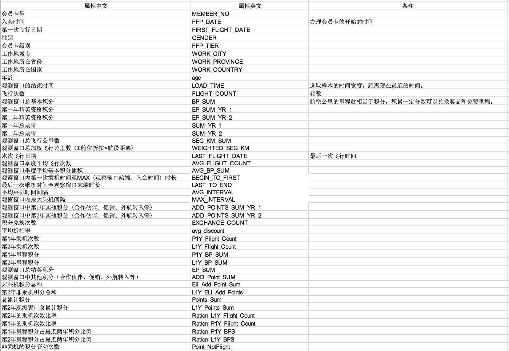
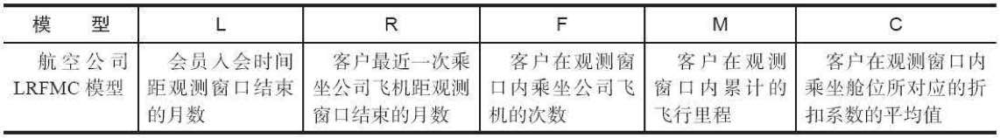
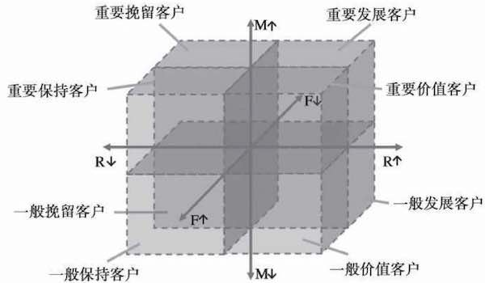

# 航空公司客户价值分析

## 背景

通过客户分类，区分无价值客户、高价值客户，企业针对不同价值的客户制定优化的个性化服务方案，采取不同营销策略

数据：

1.[航空信息属性表](data/airline_attributes.xls)

2.航空信息数据表：

> 一行一个会员卡号，列名与上面的属性表一一对应

目标：
1. 借助航空公司客户数据，对客户进行分类
2. 对不同的客户类别进行特征分析，比较不同类客户的客户价值
3. 对不同价值的客户类别提供个性化服务，制定相应的营销策略

## 分析方法和过程

通过3个指标（最近消费时间间隔（Recency）、消费频率（Frequency）和消费金额（Monetary））来进行客户细分，识别出高价值的客户，简称RFM模型。接下来依此分析各个指标：

**消费金额**：一段时间内，客户购买该企业产品金额的总和

> 航空还受到运输距离、仓位等多种影响，并不能仅仅通过消费金额来判断，例如：一位购买长航线、低等级舱位票的旅客与一位购买短航线、高等级舱位票的旅客相比，后者对于航空公司而言价值可能更高。因此除了RFM模型的三个指标以外，还要增加三个反映上述因素的指标，合在一起，统称为LRFMC模型： 

**L**：客户关系长度 
**R**：消费时间间隔 
**F**：消费频率 
**M1**：消费金额 
**M2**：一定时间内的**累积飞行里程** 
**C**：一定时间内的**仓位折扣系数均值** 

传统的RFM模型采用属性分箱（根据各维度与均值对比的大小）的方法，来划分不同的客户群体，然而这样细分的客户群太多，提高了针对性营销的成本。因此，本例采用了**聚类**的方法识别客户价值，通过对航空公司客户价值的LRFMC模型的五个指标进行K-Means聚类，识别出最有价值的客户。

## 数据抽取

name | 111 | 222 | 333 | 444
:-: | :-: | :-: | :-: | :-:
aaa | bbb | ccc | ddd | eee| 
fff | ggg| hhh | iii | 000|