# 中医证型关联规则挖掘

## 背景

中医药对乳腺癌辅助治疗有着广泛的适应证和独特的优势。在治疗过程中使用"先证而治"的方向：

* 即后续证侯尚未出现之前，需**截断**恶化病情的那些**后续证侯**。 
* 发现中医**症状间的关联关系**和诸多**症状间的规律性**，并且依据规则分析病因、预测病情发展以及为未来临床诊治提供有效借鉴。

	> 由于患者在围手术期、围化疗期、围放疗期和内分泌治疗期等各个病程阶段，基本都会出现特定的临床症状，故而可以运用中医截断疗法进行治疗，在辨病的基础上围绕各个病程的特殊证候先证而治。截断扭转的主要观点是强调早期治疗，力图快速控制病情，截断病情邪变深入，扭转阻止疾病恶化。

## 数据

### 1. 属性描述

[属性描述文件]() 
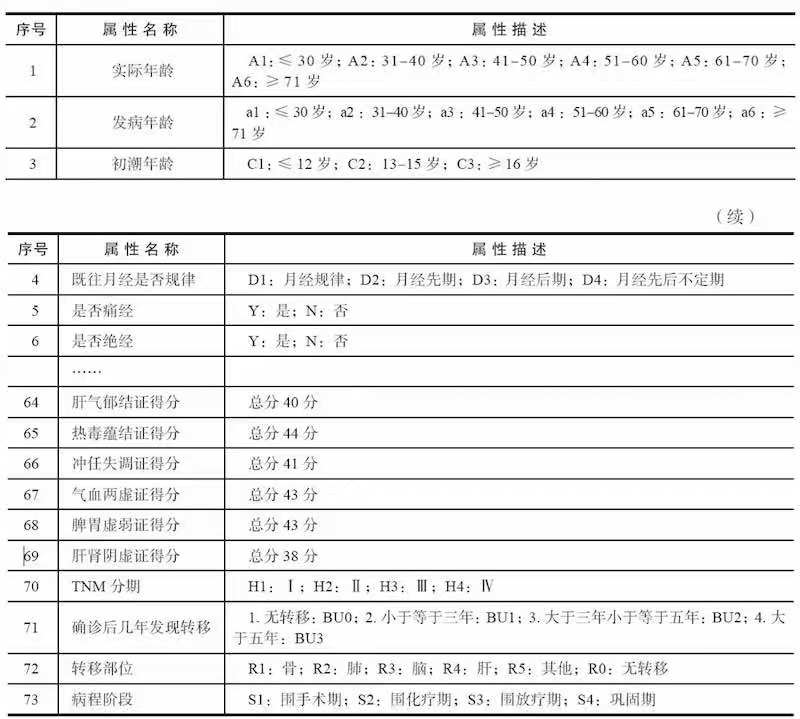 

### 2. 数据文件样本

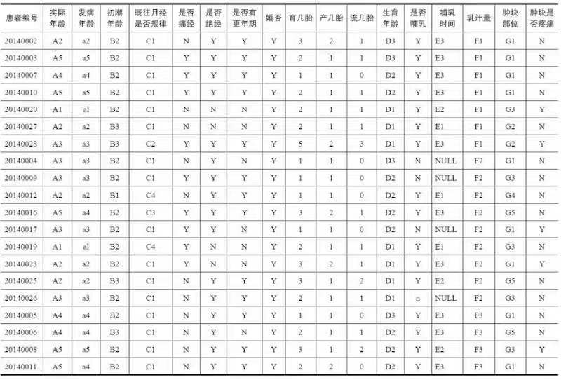 

## 分析方法和过程

1. 以问卷调查的方式对数据进行收集，并将问卷信息整理成原始数据。 

	> 的临床病理信息大部分都记录在纸张，很少存放于系统中
2. 对原始数据集进行数据预处理，包括数据清洗、属性规约、数据变换。 
3. 利用步骤`2`形成的建模数据，采用关联规则算法，调整模型输入参数，获取各中医证素与乳腺癌TNM分期之间的关系。
4. 结合实际业务，对模型结果进行分析，且将模型结果应用到实际业务中，最后输出关联规则结果。

## 数据获取

与中医医师合作、数据获取过程如下：

1. 参照中华中医药学会制定的相关指南与标准找出乳腺癌6种分型的症状

	症型 | 症状
	:-: | :-: 
	肝气郁结证型 | 乳房肿块，时觉胀痛，情绪忧郁或急躁，心烦易怒，苔薄白或薄黄，脉弦滑
	热毒蕴结证型 | 乳房肿块，增大迅速，疼痛，间或红肿，深泽溃烂，恶臭，或发热，心烦口干，便秘，小便短赤，舌暗红，有瘀斑，苔黄腻，脉弦数
	冲任失调证型 | 乳房肿块，月经前胀痛明显，或月经不调，腰腿酸软，烦劳体倦，无心烦热，口干咽燥，舌淡，苔少，脉细无力
	气血两虚证型 | 乳房肿块，与胸壁粘连，推之不动，头晕目眩，气短乏力，面色苍白，消瘦纳呆，舌淡，脉沉细无力
	脾胃虚弱证型 | 纳呆或腹胀，便溏或便秘，舌淡，苔白腻，迈细弱
	肝肾阴虚证型 | 头晕目眩，腰膝酸软，目涩梦多，咽干舌燥，大便干结，月经紊乱或停经，舌红，苔少脉细数

2. 根据分型症状、与医院医师合作拟定问卷表

	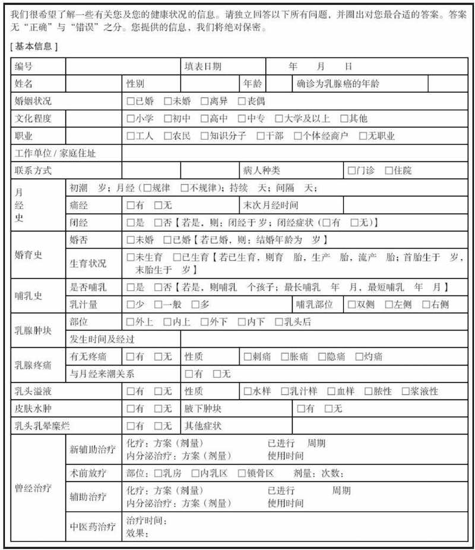 
	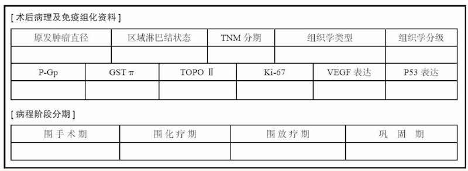 

3. 制定诊断量表（肝气郁结证为例）

	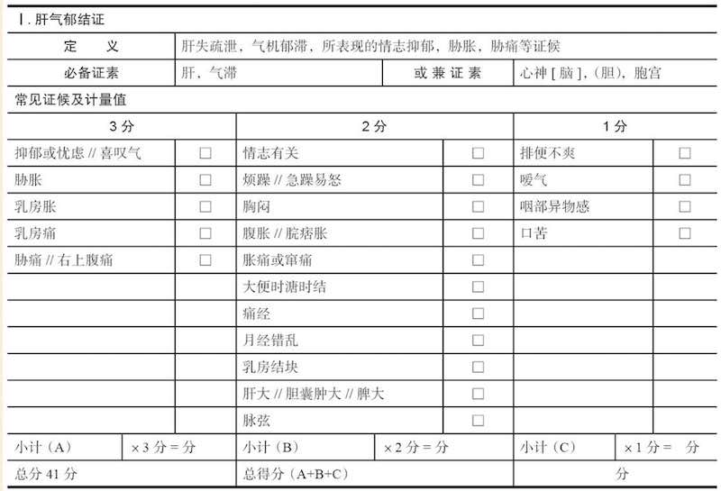

4. 定义纳入标准与排除标准
	
	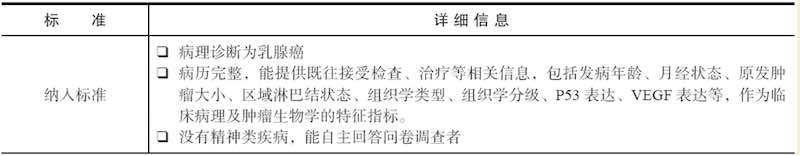 
	
	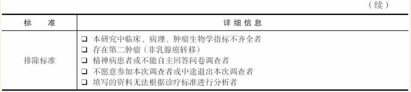

5. 数据采集人员要求

* 问卷信息采集者均要求有中医诊断学基础，能准确识别病人的舌苔脉象，用通俗的语言解释医学术语，并确保患者信息填写准确。
* 问卷调查对象必须是三阴乳腺癌患者。
	
## 数据预处理

### 1. 数据清理：根据纳入标准和排出标准，对问卷进行筛选

	共发放1253份问卷，回收1046份，筛选之后有效问卷930份

### 2. 属性规约：

	问卷中共73个属性，为了有效挖掘（剔除冗余属性以及不相关属性），选取6种证型的得分（见《诊断量表》）以及乳腺癌TNM分期属性值构成数据集。

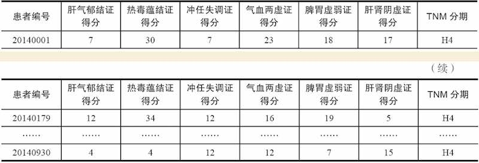

### 3. 数据变换：

方法：首先通过属性构造，获得证型系数，然后通过聚类算法对数据进行离散化处理，形成建模数据

#### (1) 计算证型系数：

为了更好地反映出中医证素分布的特征，用证型系数替代证型得分，计算公式为：`当前样本证型系数＝当前样本该证型得分/所有样本该证型总分`

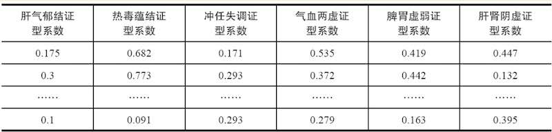

#### (2) 数据离散化

由于Apriori关联规则算法无法处理连续型数值变量，需要将各个连续变量（证型系数）转换为离散变量。
离散化使用聚类的方法进行，代码如下：

[代码：连续属性离散化](code/8-1_discretization.py)

聚类结果如下：

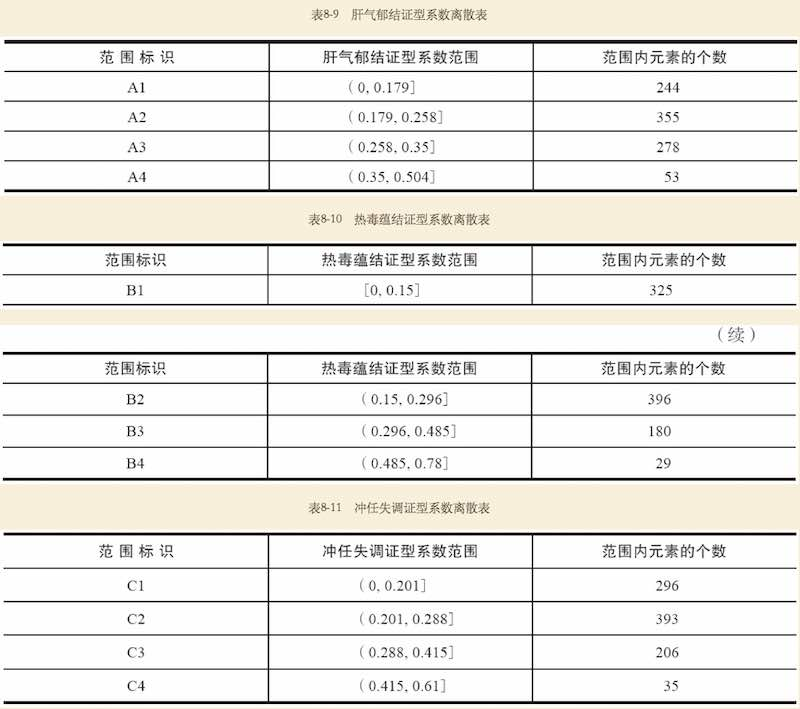 
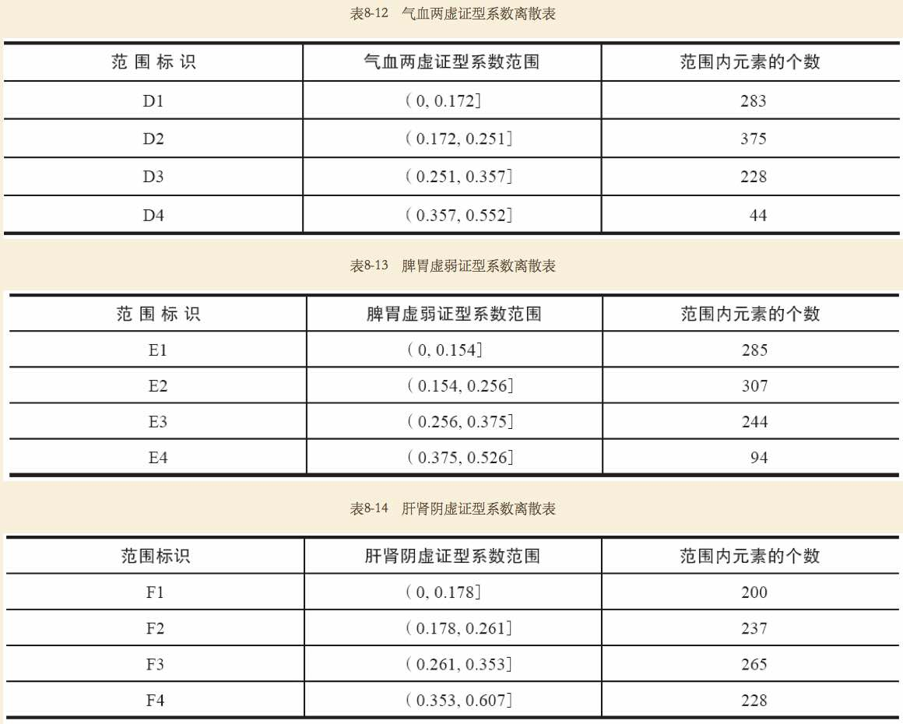 

#### (3) 模型数据集

最终构建得到的模型数据集如下 

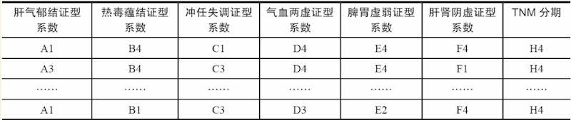 

## 模型构建

**目标**：的目标是探索乳腺癌患者TNM分期与中医证型系数之间的关系 
**方法**：关联规则算法，挖掘它们之间的关联关系

> 关联规则算法主要用于寻找数据集中项之间的关联关系。它揭示了数据项间的未知关系，基于样本的统计规律，进行关联规则挖掘。根据所挖掘的关联关系，可以从一个属性的信息来推断另一个属性的信息。当置信度达到某一阈值时，就可以认为规则成立

**建模流程**：

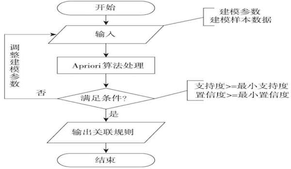 

> 输入：(1)样本；(2)建模参数 
> 算法处理：Apriori 
> 输出：关联规则 

**代码**：
[8-2_apriori_rules.py](code/8-2_apriori_rules.py) [apriori.py](code/apriori.py) [apriori_rules.py](code/apriori_rules.py)

**具体步骤**：

1. 设置建模参数最小支持度、最小置信度
2. 输入建模样本数据，用Apriori分析样本，分析目标为模型的最小支持度、最小置信度
3. 如果所有的规则都不满足条件，则需要重新调整模型参数，否则输出关联规则结果

> 最小支持度与最小置信度，并没有统一的标准。主要根据业务经验设置初始值，然后经过多次调整 
> 本例选取的参数为：最小支持度6%、最小置信度75%

**模型输出**：

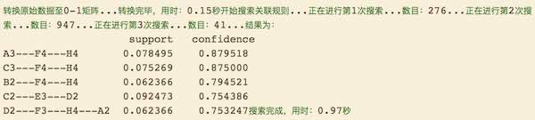

## 模型分析

上述模型共得到5个关联规则，但是并非所都有意义，我们只在乎那些以H为规则结果的规则 

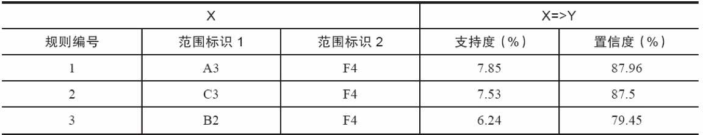

> X表示各个证型系数范围标识组合而成的规则 
> Y表示TNM分期为H4期 
> A3表示肝气郁结证型系数处于（0.258，0.35]范围内的数值 
> B2表示热毒蕴结证型系数处于（0.15，0.296]范围内的数值 
> C3表示冲任失调证型系数处于（0.288，0.415]范围内的数值 
> F4表示肝肾阴虚证型系数处于（0.353，0.607]范围内的数值 

分析模型输出，得到结论如下：

1. A3、F4=>H4支持度最大（7.85%），置信度最大（87.96%） 
	
	说明肝气郁结证型系数处于（0.258，0.35]，肝肾阴虚证型系数处于（0.353，0.607]范围内，TNM分期诊断为H4期的可能性为87.96%，而这种情况发生的可能性为7.85%

2. C3、F4=>H4支持度7.53%，置信度87.5%

	说明冲任失调证型系数处于（0.201，0.288]，肝肾阴虚证型系数处于（0.353，0.607]范围内，TNM分期诊断为H4期的可能性为87.5%，而这种情况发生的可能性为7.53%。

3. B2、F4=>H4支持度6.24%，置信度79.45%

	说明热毒蕴结证型系数处于（0.15，0.296]，肝肾阴虚证型系数处于（0.353，0.607]范围内，TNM分期诊断为H4期的可能性为79.45%，而这种情况发生的可能性为6.24%。

综合以上分析，TNM分期为H4期的三阴乳腺癌患者证型主要为肝肾阴虚证、热毒蕴结证、肝气郁结证和冲任失调，H4期患者肝肾阴虚证和肝气郁结证的临床表现较为突出，其置信度最大达到87.96%

> 中医解释：生理上，肝藏血，肾藏精，精血同源，肝肾同源，如《张氏医通》所言：“气不耗，归精于肾而为精；精不泄，归精于肝而化清血。”在病理上，肝肾病变常相互影响，肾阴不足无以养肝阴，肝阳化火则燔灼肾阴。Ⅳ期三阴乳腺癌患者多病程迁延，癌毒久蕴，不论是化疗还是放疗，均会耗伤气血津液，故见肝肾阴虚之证。由于肝肾阴液是冲任二脉的物质基础，肝肾阴虚则精血不足，故冲任失调。且古今医家皆认为乳腺癌的形成与“肝气不舒郁积而成”有关系，心理学中抑郁内向的C型人格特征也被认为是肿瘤发生的高危因素之一，所以Ⅳ期三阴乳腺癌患者多有肝气郁结证的表现

## 模型应用

> 模型结果表明TNM分期为Ⅳ期的三阴乳腺癌患者证型主要为肝肾阴虚证、热毒蕴结证、肝气郁结证和冲任失调证。其中，Ⅳ期患者肝肾阴虚证和肝气郁结证的临床表现较为突出，其置信度最大达到87.96%，且肝肾阴虚证临床表现都存在。

当Ⅳ期患者出现肝肾阴虚证之表现时，应当选取滋补肝肾、清热解毒类抗癌中药，以滋养肝肾为补，清热解毒为攻，攻补兼施，截断热毒蕴结证的出现，为患者接受进一步治疗争取机会。由于患者多有肝气郁结证的表现，在进行治疗时须本着身心一体、综合治疗的精神，重视心理调适。一方面要在药方中注重疏肝解郁，另一方需要及时疏导患者抑郁、焦虑的不良情绪，帮助患者建立合理的认知，树立继续治疗延长生存期的勇气

