# 家用电器用户行为分析与事件识别

## 背景与挖掘目标

<b>背景</b>：

* 了解不同用户群（因气候、区域、年龄、性别差异等形成）的不同使用习惯（例如热水器用户用水行为特征：洗浴、洗手、洗脸、刷牙、洗菜、做饭等），开发新功能，就能开拓新市场。
* 本项目以热水器为例子
 
<b>数据来源</b>：热水器状态发生改变或者有水流状态时，采集到的时间序列数据 

> 是顺序排列的离散的用水时间点 
> 根据水流量和停顿时间间隔划分为不同大小的时间区间，每个区间是一个可理解的一次完整用水事件 

以热水器一次完整用水事件为一个基本事件，可以将时间序列数据划分为独立的用水事件并识别出其中属于洗浴的事件，也可以从热水器智能操作和节能运行等多方面对产品进行优化

<b>目标</b>：划分热水器完整用水事件，并从中识别出洗浴事件

> 基于洗浴事件模型识别，可以比较不同客户群的客户使用习惯、加深对客户的理解 
> 从而可以给不同的客户群提供最适合的个性化产品、改进新产品的智能化的研发和制定相应的营销策略 

<b>数据样本</b>：

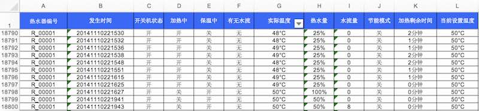

详细数据: [data/original_data.xls.tar.gz](data/original_data.xls.tar.gz)

## 分析方法与过程

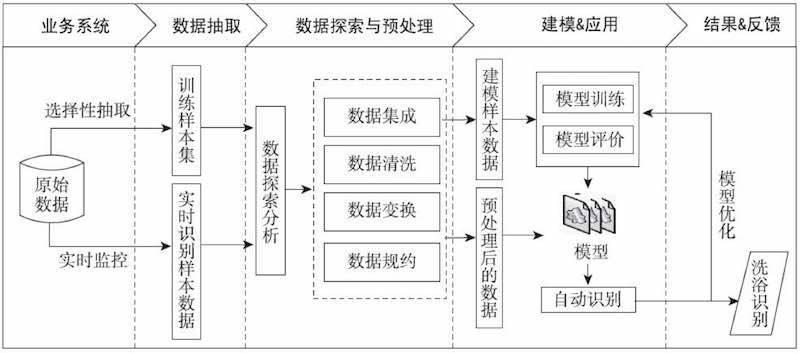

上图所述的5个步骤具体如下：

1. <b>数据抽取</b>：对热水用户的历史用水数据进行选择性抽取
2. <b>数据探索分析和预处理</b>：对上一步输出的数据集，探索分析和预处理，包括：
	
	* 探索用水事件时间间隔的分布
	* 规约冗余属性
	* 识别用水数据的缺失值，并对缺失值进行处理
	* 根据建模的需要进行属性构造等
	
	根据以上处理，对用水样本数据建立用水事件时间间隔识别模型和划分一次完整的用水事件模型
	再在一次完整用水事件划分结果的基础上，剔除短暂用水事件，缩小识别范围

3. 在上一步基础上，建立洗浴事件识别模型，对洗浴事件识别模型进行模型分析评价
4. 对上一步形成的模型结果应用并对洗浴事件划分进行优化。
5. 调用洗浴事件识别模型，对实时监控的热水器流水数据进行洗浴事件自动识别。

## 数据抽取

问题1: 智能热水器在状态发生改变或者水流量非零时，每两秒会采集一条状态数据。由于数据的采集频率较高，并且数据来自大量用户，数据总量非常大

> 对原始数据采用无放回随机抽样法抽取200家热水器用户从2014年1月1日至2014年12月31日的用水记录作为原始建模数据

抽取得到的属性字段：

属性名称 | 属性说明
:-: | :-: 
热水器编码 | 热水器出厂编号
发生时间 | 记录热水器处于某状态的时刻
开关机状态 | 热水器是否开机
加热中 | 热水器处于对水进行加热的状态
保温中 | 热水器处于对水进行保温的状态
有无水流 | 热水水流量大雨等于10L/min为有水、否则为无
实际温度 | 热水器中热水的实际温度
热水量 | 热水器热水的含量
水流量 | 热水器热水的水流速度 单位：L/min
节能模式 | 热水器的一种节能工作模式
加热剩余时间 | 加热到设定温度还需要多长时间
当前设置温度 | 热水器加热时热水能够到达的最大温度

## 数据探索分析

解决如何切分用水事件：两条水流量不为0的数据之间会有一段时间间隔，同一次用水事件的内部会有用水间隔，两次用水事件之间也会有间隔。希望选择一个间隔阈值，作为切分用水事件的依据，该阈值取多少合适

* 现场实验统计：用水过程中的水停顿一般不大于4分钟
* 频率分布直方图统计：0～0.3分钟的停顿时间频率很高；6～13分钟的频率较低；两次用水事件之间停顿间隔位于3～7分钟，与现场实验统计间隔近似

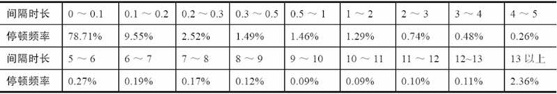

## 数据预处理

处理数据集中缺失值、与分析主题无关的属性，未直接反应用水事件属性等问题；采用数据规约和属性构造

### 1.数据规约

> 去除“热水器编号”：只对洗浴行为的一般规律进行挖掘 
> 去除“有无水流”：可通过“水流量”反映 
> 去除“节能模式”：都只为“关”，对建模无作用

详细数据: [data/water_heater.xls.tar.gz](data/water_heater.xls.tar.gz)
water_heater.xls

### 2.数据变换

背景

> 1. 从原始数据中识别出哪些状态记录是一个完整的用水事件（包括洗脸、洗手、刷牙、洗头、洗菜和洗浴等），从而再识别出用水事件中的洗浴事件
> 2. 一次完整的用水事件是根据水流量和停顿时间间隔的阈值去划分的

方法：

1. 水停顿阈值寻优模型
2. 筛选规则，用于剔除明显不是洗浴的事件

步骤：1. 用水事件划分；2.水停顿间隔阈值寻优；3.特征构造；4.筛选“候选洗浴事件”；5.得到建模数据样本集

#### 步骤1：用水事件划分

根据用水停顿时间间隔划分，时间阈值暂定为4分钟：[代码：划分用水事件](code/10-1_divide_event.py) 
划分结果样例：

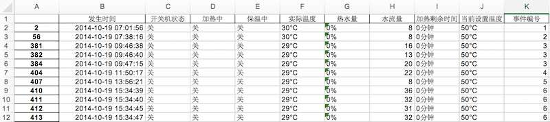

#### 步骤2：用水事件阈值寻优模型

> 不同地区用水习惯不同、不同季节热水器停顿时长也不同，固定的停顿阈值并不合适

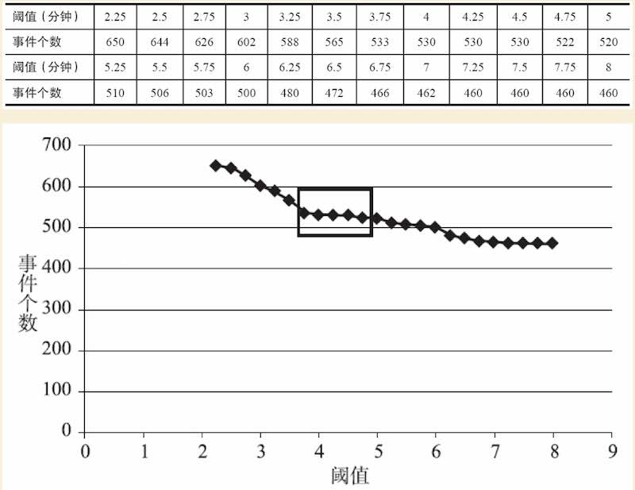

用户的用水数据存储在数据库中，记录了各种各样的用水事件（洗浴、洗手、刷牙、洗脸、洗衣和洗菜等） 
上图纵坐标是停顿间隔小于阈值的样本总数，横坐标是阈值，可以看到其中有一段平缓段，将这段的起始点用作寻优后的阈值 

[代码：水停顿时间阈值寻优](code/10-2_threshold_optimization.py)

#### 步骤3：特征构造

构造4类指标：时长指标、频率指标、用水的量化指标以及用水的波动指标

##### 时长指标

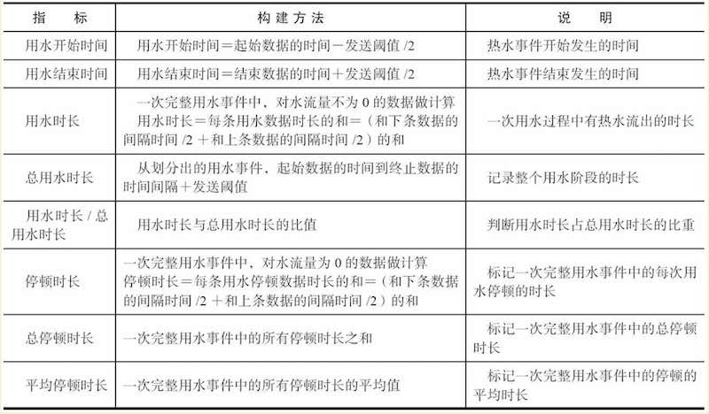

##### 频率指标

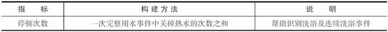

##### 用水的量化指标
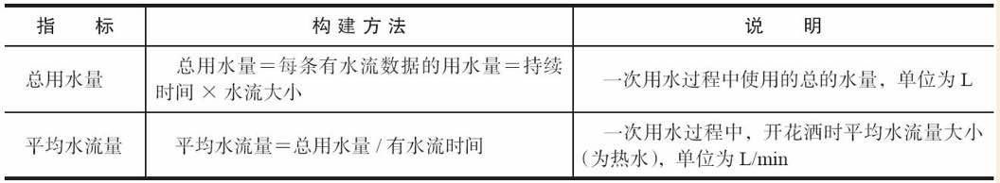

##### 用水波动指标
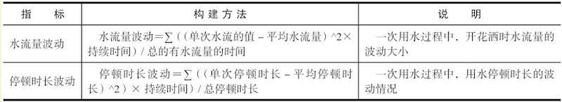

图示上述指标计算依据：

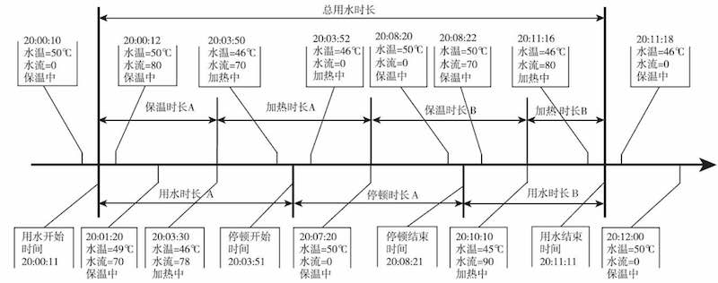

#### 步骤4：

用以下3个条件筛选掉哪些非常短暂、显然不是洗浴的用水事件（满足下列任意一个条件即被过滤）

1. 一次用水事件中总用水量（纯热水）小于y升。
2. 用水时长小于100秒。
3. 总用水时长小于120秒。

接下来计算y的取值：

1. 洗澡的水温（热水冷水混合后）一般为37~41℃，因此热水器设定的温度越高（混合的冷水越多、热水占比越少）、纯热水使用量就越少

	> 取洗浴温度的均值为39℃来计算热水器不同设定温度下的热水使用量阈值

2. 经过实验分析，热水器设定温度为50℃时，一次普通的洗浴时长为15分钟，总用水时长10分钟左右，热水的使用量为10~15升

	> 为了不影响特殊的短暂的洗浴事件，以及考虑到夏天用的热水较少，放宽范围假定热水器在设定温度为50℃时，一次洗浴的总热水使用量为5升

3. 依据上述思路，假设两次洗浴事件热水和冷水混合后的花洒出水水温度恒为T摄氏度，列出如下热守恒公式
	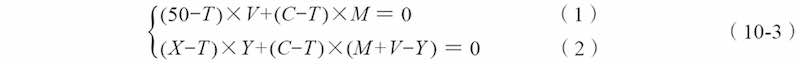
	
	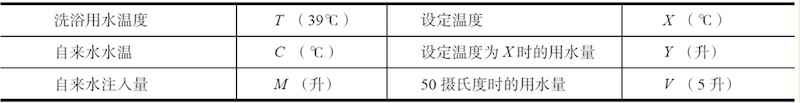
	
	>（1）式是50℃的热水V升与M升C℃自来水混合得到M+V升T摄氏度的洗浴用水的热守恒公式。 
	>（2）式是X℃的热水Y升与M+VY升C℃自来水混合得到M+V升T℃的洗浴用水的热守恒公式。 

4. 解上述公式可以计算出标准热水使用量

	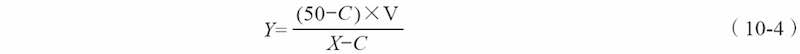

## 数据清洗

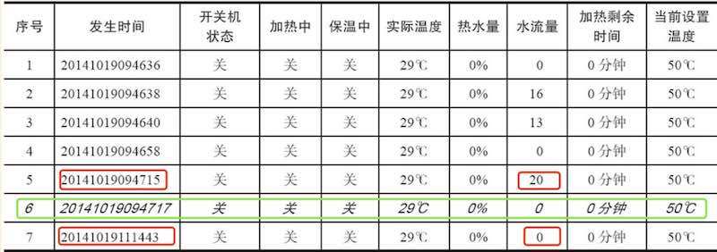

关热水事件会丢失、或因为网络问题很久之后才被记录，导致的结果是，错误得到一个持续时间超长的用水记录（如上图中的数据5、7）。解决办法是添加一条关热水事件（上图中的数据6）

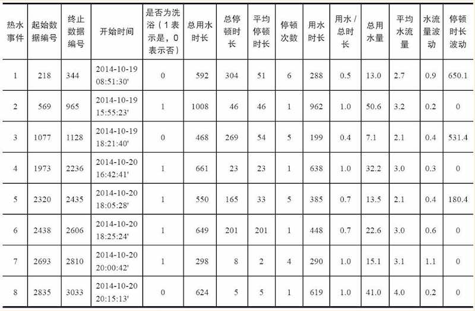

最终用于训练模型的数据如上

## 模型构建

使用神经网络来进行二分类，识别是否是洗浴事件（输出范围是[-1,1])。调参后发现2个隐藏层（节点数分别是17、10）的时候效果比较好

[代码：神经网络](code/10-3_neural_network.py)

## 模型检验

用测试集检验模型，准确率为85.5%

 
