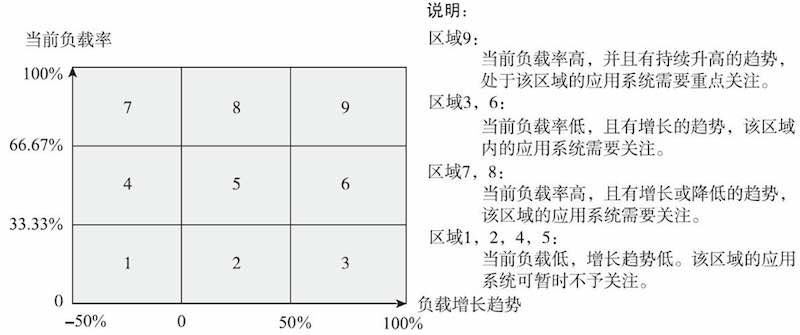
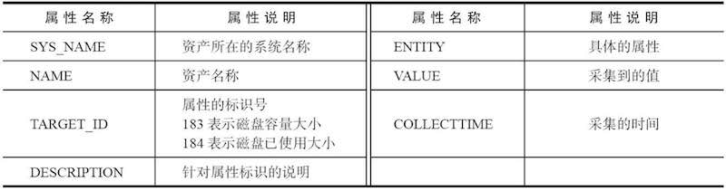
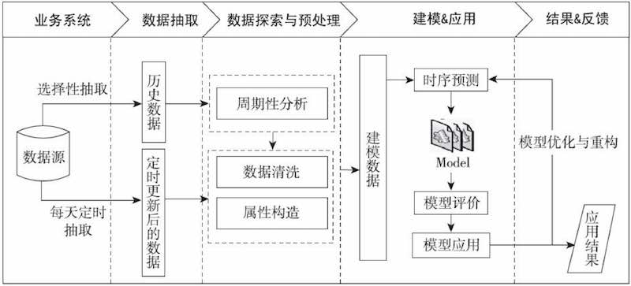
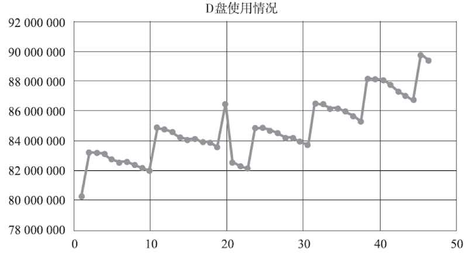
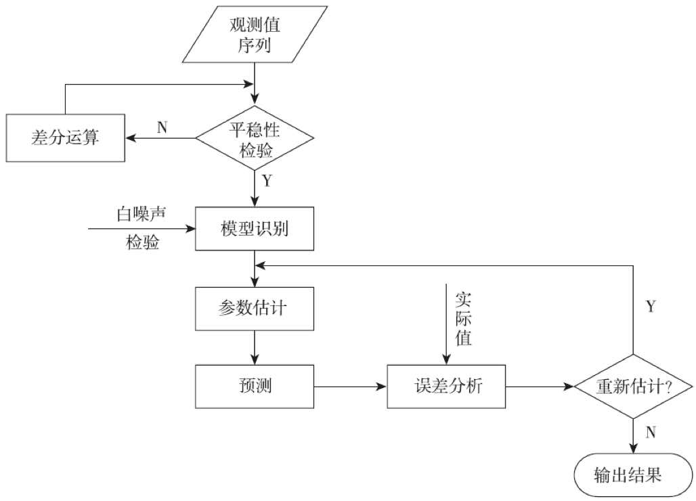
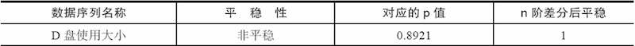
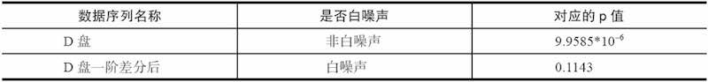
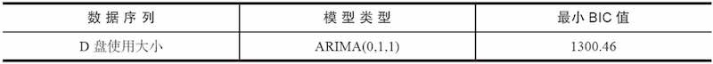
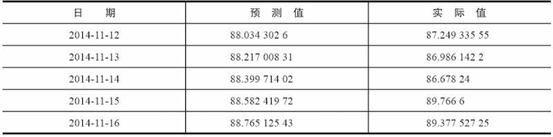
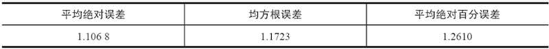

# 应用系统负载分析与磁盘容量预测

## 背景

分析存储设备中磁盘容量预测，可预测磁盘未来几天的磁盘占用量，根据需求设置不同预警等级，提供定制化预警提示

## 数据

字段说明

数据样例

完整数据: [data/discdata.xls](data/discdata.xls) 

## 过程

<b>数据抽取</b>：从数据源中选择性抽取历史数据与每天定时抽取数据。 
<b>数据探索与预处理</b>：对抽取的数据进行周期性分析以及数据清洗、数据变换等操作后，形成建模数据。 
<b>建模</b>：采用时间序列分析法对建模数据进行模型的构建，利用模型预测服务器磁盘已使用情况。 
<b>应用</b>：应用模型预测磁盘使用情况，向管理员发送报警。 

## 时间序列

[https://www.kaggle.com/fangkun119/learn-time-series-analysis-in-python](https://www.kaggle.com/fangkun119/learn-time-series-analysis-in-python)

## 数据抽取

根据TARGET_ID（磁盘已使用大小、磁盘容量），ENTITY（C：，D：），COLLECTIME（采集时间）采集VALUE字段

## 数据探索分析

采用时序分析法建模，为了建模需要，要探索数据的平稳性（通过时序图可以初步发现数据的平稳性）。 
针对服务器已使用大小，以天为单位进行周期性分析 

## 数据预处理

1. 磁盘容量（固定值、不考虑磁盘扩容的情况下）去重：每个磁盘容量数据合并成1条 
2. 主key合并：将<TARGET_ID, ENTITY, NAME>合并成一个字段

	合并前、合并后的数据：
	
	
	[代码：主key合并](code/11-1_attribute_transform.py)

3. 训练集、测试集划分（后5条为测试集）

## 模型构建过程

1. 数据平稳 

	> 对观测值序列进行平稳性检验 
	> 如果不平稳，则对其进行差分处理直到差分后的数据平稳 

2. 白噪声检验及模式识别 

	> 数据平稳后、进行白噪声检验 
	> 如果没有通过白噪声检验，就进行模型识别，识别其模型属于AR、MA和ARMA中的哪一种模型 
	
3. 参数估计，误差分析 

	> 通过BIC信息准则对模型进行定阶，确定ARIMA模型的p，q参数 
	> 在模型识别后需进行模型检验，检测模型残差序列是否为白噪声序列。 
	> 如果模型没有通过检测，需要对其进行重新识别，对已通过检验的模型采用极大似然估计方法进行模型参数估计。

最后，应用模型进行预测，将实际值与预测值进行误差分析。如果误差比较小（误差阈值需通过业务分析进行设定），表明模型拟合效果较好，则模型可以结束。反之需要重新估计参数。

## 模型构建各环节用到方法

### 1. 平稳性检验

<b>用途</b>：为了确定原始数据序列中没有随机趋势或确定趋势，需要对数据进行平稳性检验，否则将会产生“伪回归”的现象。 
<b>方法</b>：采用单位根检验（ADF）的方法或者时序图的方法进行平稳性检验 

[代码：平稳性检验](code/11-2_stationarity_test.py)

检验结果： 

### 2. 白噪声检验：

<b>用途</b>：为了验证序列中游泳的信息是否已经被提取完毕，需要对序列进行白噪声检验（如果序列检验为白噪声序列，就说明序列中有用的信息已经被提取完毕了，剩下的全是随机扰动，无法进行预测和使用） 
<b>方法</b>：采用LB统计量的方法进行白噪声检验

[代码：白噪声检查](code/11-3_whitenoise_test.py)

检验结果： 

### 3. 模式识别

<b>方法</b>：采用极大似然比方法进行模型的参数估计，估计各个参数的值。然后针对各个不同模型，采用BIC信息准则对模型进行定阶，确定p，q参数，从而选择最优模型

<b>结果</b>： 
 

[代码：模式识别](code/11-4_find_optimal_pq.py)

### 4. 模型检验

<b>用途</b>：模型确定后，检验其残差序列是否为白噪声。如果不是白噪声，说明残差中还存在有用的信息，需要修改模型或者进一步提取。 

<b>结果</b>：ARIMA（0，1，1）模型成功地通过了检验 

[代码：模型检验](code/11-5_arima_model_check.py)

### 5. 模型预测

应用通过检验的模型进行预测，获取未来5天的预测值，并且与实际值作比较，也就是我们在建模型的时候所忽略的最后5个数据

## 模型评价

采用3个衡量模型预测精度的统计量指标：平均绝对误差、均方根误差和平均绝对百分误差，从不同侧面反映预测精度 

[代码](code/11-6_cal_errors.py) 

## 模型应用

步骤如下：

1. 从系统中每日定时抽取服务器磁盘数据。
2. 对定时抽取的数据进行数据清洗、数据变换预处理操作。
3. 将预处理后的定时数据存放到模型的初始数据中，获得模型的输入数据，调用模型对服务器磁盘已使用空间进行预测，预测后5天的磁盘已使用空间大小。
4. 将预测值与磁盘的总容量进行比较，获得预测的磁盘使用率。如果某一天预测的使用率达到业务设置的预警级别，就会以预警的方式提醒系统管理员。

> 因为模型采用历史数据进行建模，随着时间的变化，每天会定时地将新增数据加入初始建模数据中。在正常的情况下，模型需要重新调整。但考虑到建模的复杂性高，且磁盘的已使用大小每天的变化量相对很小，对于整个模型的预测影响较小。因此，结合实际业务情况，每半个月对模型进行一次调整

