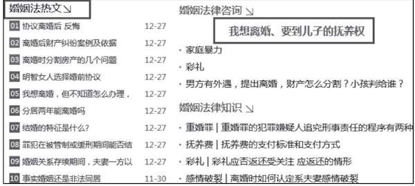
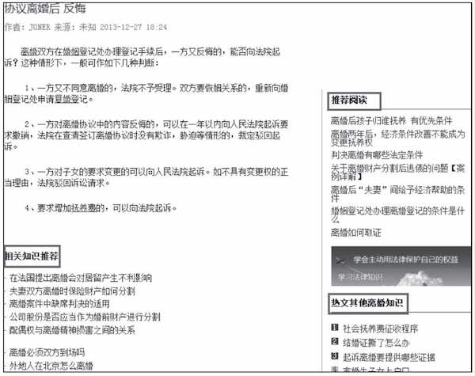
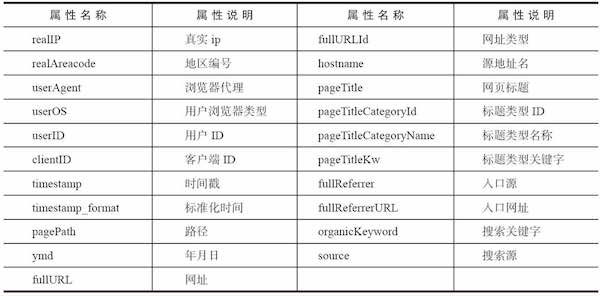
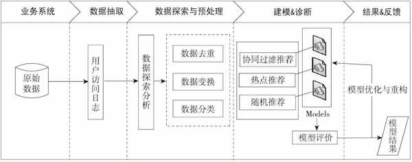

# 电子商务网站用户行为分析及服务推荐

## 背景及目标

通过分析用户的历史行为，主动向用户推荐能够满足他们兴趣和需求的信息。研究对象是北京某家法律咨询网站，数据量在大幅增长中，导致用户因为不能找到自己需要的信息而流失。该项目希望能够研究和分析用户的需求和行为，发现用户的兴趣点，引导用户发现自己的需求，将长尾网页（用户感情趣但是很难找到的网页）准确推荐给用户，提供个性化服务。

应用样例：

1. 访问主页时在婚姻栏目展现的热点推荐

	

2. 访问具体知识页面时，展示相关知识页面推荐

	

## 数据

(其中IP是经过了脱敏处理的真实IP）

希望： 

> 按地域研究用户访问时间、访问内容和访问次数等分析主题，深入了解用户对访问网站的行为和目的及关心的内容。
> 借助大量的用户的访问记录，发现用户的访问行为习惯，对不同需求的用户进行相关的服务页面的推荐。

## 分析方法

采用协同过滤，但是需要先对数据做分类处理（指网页分类、和用户分类）

> 做分类处理的原因是：如果不进行分类处理、对所有记录直接推荐，会存在以下问题：
> 
> * 数据量太大，构建稀疏矩阵时会出现内存空间不够的问题
> * 用户区别很大、不同用户关注信息不一样、过于细粒度的数据会影响推荐效果

如何判断用户是否对网页感兴趣

> 网页浏览时长数据（强特征）：缺失 
> 先对网页类型分类、然后做类别推荐

## 分析过程

* 从系统中获取用户访问网站的原始记录。
* 对数据进行多维度分析，包括用户访问内容，流失用户分析以及用户分类等分析。
* 对数据进行预处理，包含数据去重、数据变换和数据分类等处理过程。
* 以用户访问html后缀的网页为关键条件，对数据进行处理。
* 对比多种推荐算法进行推荐，通过模型评价，得到比较好的智能推荐模型。通过模型对样本数据进行预测，获得推荐结果。

## 数据抽取

> 考虑到协同过滤算法的特性（通过历史数据找出相似的用户或者网页）。因此，在数据抽取的过程中，尽可能选择大量的数据，这样就能降低推荐结果的随机性 

抽取方法： 

* 选取3个月内用户的访问数据作为原始数据集。
* 每个地区的用户访问习惯以及兴趣爱好存在差异性，本例抽取广州地区的用户访问数据进行分析，其数据量总计有837450条记录
* 数据字段包括：用户号、访问时间、来源网站、访问页面、页面标题、来源网页、标签、网页类别和关键词

抽取代码（从数据库中读取数据）
[code/12-1_sql_value_counts.py](code/12-1_sql_value_counts.py)

## 数据探索分析

