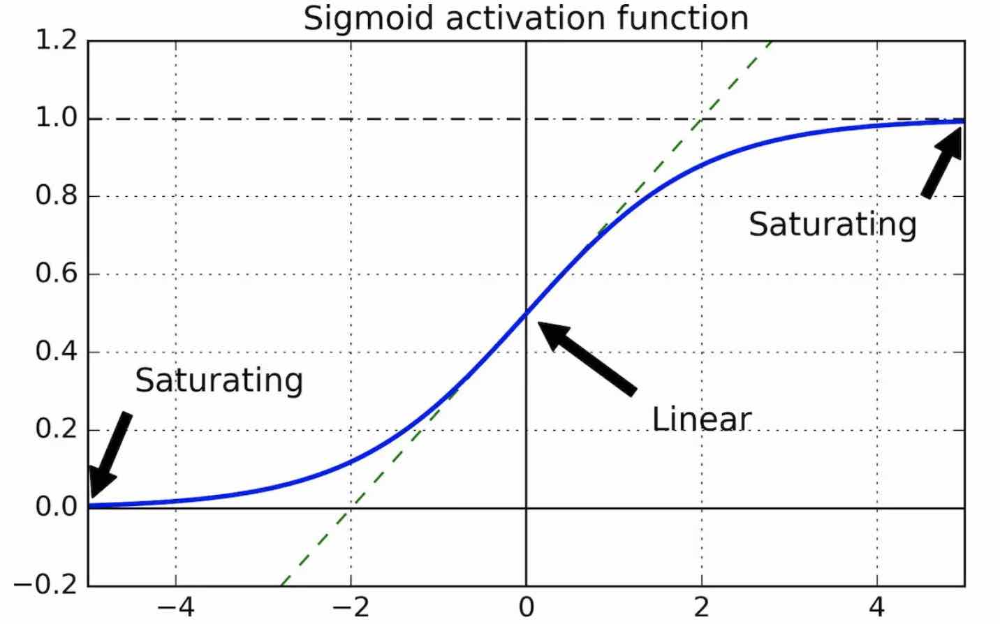
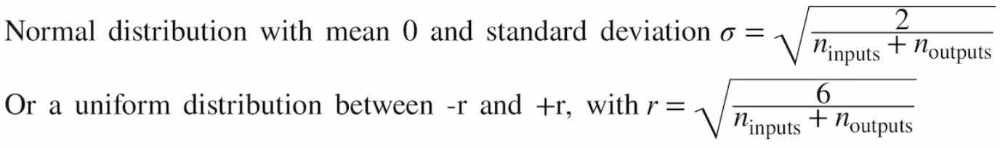
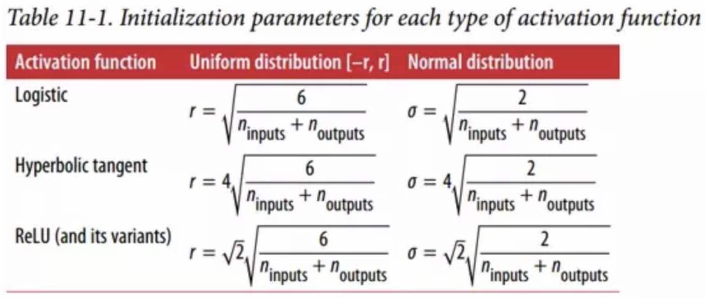
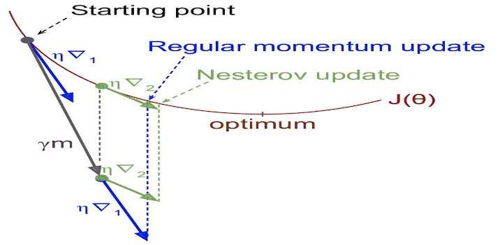
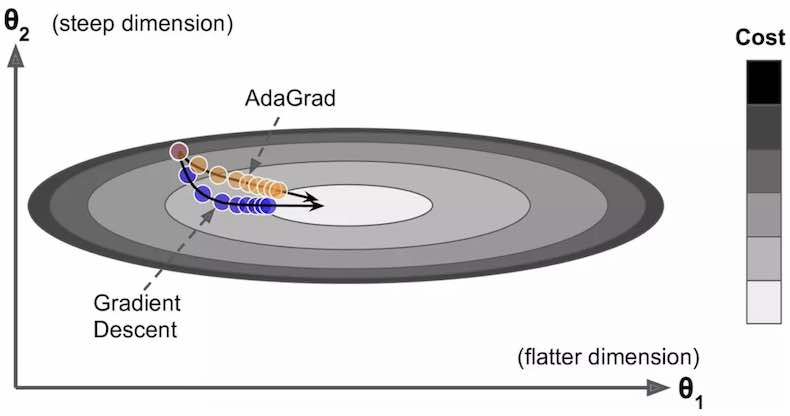
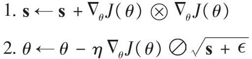
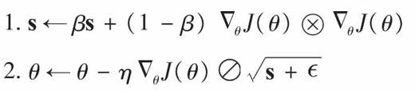
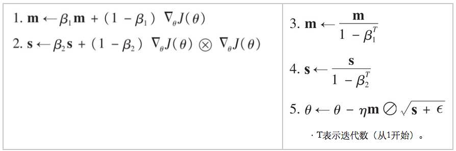

# 训练深度神经网络

[https://www.jianshu.com/p/85bb910a7594](https://www.jianshu.com/p/85bb910a7594)

## 1.梯度消失
反向传播算法的工作原理是从输出层到输入层，传播误差的梯度。 一旦该算法已经计算了网络中每个参数的损失函数的梯度，它就通过梯度下降使用这些梯度来更新每个参数。

不幸的是，随着算法进展到较低层，梯度往往变得越来越小。 结果，梯度下降更新使得低层连接权重实际上保持不变，并且训练永远不会收敛到良好的解决方案。 这被称为梯度消失问题

## 2.梯度爆炸

梯度可能变得越来越大，许多层得到了非常大的权重更新，算法发散。这是梯度爆炸的问题，在[循环神经网络](https://www.jianshu.com/p/9b7df8250000)中最为常见。 更一般地说，深度神经网络受梯度不稳定之苦; 不同的层次可能以非常不同的学习速率。

## 3.logistic激活函数梯度消失问题分析

> 论文：“Understanding the Difficulty of Training Deep Feedforward Neural Networks” by Xavier Glorot and Yoshua Bengio

**实验环境：**

* 模型权重初始值：按均值为0、方差为1初始化 
* 被考察的激活函数：logistic（输出均值是0.5），tanh（输出均值是0）

**观察现象：**

* 每层输出的方差远大于其输入的方差（梯度消失）
* 网络正向，每层的方差持续增加，直到激活函数在顶层饱和（logistic输出均值不为0导致、tanh会好一些）

**原因分析：**

 

当输入变大（负或正）时，函数饱和在 0 或 1，导数非常接近 0。因此，当反向传播开始时， 它几乎没有梯度通过网络传播回来，而且由于反向传播通过顶层向下传递，所以存在的小梯度不断地被稀释，因此较低层确实没有任何东西可用

**解决方法：**

我们需要信号在两个方向上正确地流动：在进行预测时是正向的，在反向传播梯度时是反向的。 我们不希望信号消失，也不希望它爆炸并饱和。 为了使信号正确流动，作者认为，我们**需要每层输出的方差等于其输入的方差**。而且我们**也需要梯度在相反方向上流过一层之前和之后有相同的方差**。实际上不可能保证两者都是一样的，除非这个层具有相同数量的输入和输出连接。但是他们提出了一个很好的折衷办法，在实践中证明这个折中办法非常好，即按照如下两个公式之一初始化连接权重（其中`n_inputs`和`n_outputs`是权重正在被初始化的层（也称为扇入和扇出）的输入和输出连接的数量。

当`n_inputs = n_outpus`时，上面公式可以进一步简化为σ=1*(ninputs)1/2或r=31/2 * ninputs1/2 

## 4.通过Xavier模型权重初始化来缓解梯度消失、梯度爆炸的问题

**(1) 权重初始化公式**

除了上面的logistic激活函数，tanh和ReLU（及其变体包括ELU）激活函数也有类似的模型权重初始化公式，统称为Xavier（根据作者名字）模型权重初始化、有时也被称为Glorot初始化（根据作者姓式）。而ReLU的初始化策略有时被称为He初始化（根据作者姓式）。

每个激活函数都有两种选择，按照上表左侧的公式将权重初始化为正太分布，或者按照右侧的公式初始化为均匀分布

**(2) TensorFlow模认实现：**

查API确认使用的是哪种初始化方法，例如`TensorFlow`的`dense()`方法，默认使用`glorot_uniform_initializer`来初始化

> **`dense`**: [api_doc](https://www.tensorflow.org/api_docs/python/tf/layers/dense?hl=en)  
> **`kernel_initializer`**: Initializer function for the weight matrix. If None (default), weights are initialized using the default initializer used by tf.get_variable. 
> **`get_variable`**: [api_doc](https://www.tensorflow.org/api_docs/python/tf/get_variable?hl=en) 
> **`glorot_uniform_initializer`**: [api_doc](https://www.tensorflow.org/api_docs/python/tf/glorot_uniform_initializer?hl=en) 

**(3) 定制初始化策略：**

可以使用`variance_scaling_initializer`

> 注意He初始化默认只考虑`n_input`，如果希望同时考虑`n_input`和`n_output`，需要为`variance_scaline_initializer()`设置mode="FAN_AVG"参数 
文档：[variance_scaling_initializer](https://www.tensorflow.org/versions/r1.10/api_docs/python/tf/variance_scaling_initializer?hl=en)

代码：

~~~python
import tensorflow as tf
reset_graph()
n_inputs = 28 * 28  # MNIST
n_hidden1 = 300

X = tf.placeholder(tf.float32, shape=(None, n_inputs), name="X")
he_init = tf.variance_scaling_initializer()
hidden1 = tf.layers.dense(X, n_hidden1, activation=tf.nn.relu, kernel_initializer=he_init, name="hidden1")
~~~

## 4. 用非饱和激活函数来缓解梯度消失、梯度爆炸的问题

**(1) S型激活函数(如Logistic激活函数)**  

S型激活函数在生物神经元中可见，但在DNN中却表现不如ReLU (S型激活函数会把正值的导数降低直至无限接近0)

~~~python
def logit(z):
    return 1 / (1 + np.exp(-z))
~~~

**(2) ReLU激活函数** 

表现比S型函数好，因为它不稀释正值；但会出现dying ReLU问题（神经元死了，只输出0）特别是使用较大的训练速度时

~~~python
he_init = tf.variance_scaling_initializer()
hidden1 = tf.layers.dense(X, n_hidden1, activation=tf.nn.relu, kernel_initializer=he_init, name="hidden1")
~~~

**(3) LeakyReLU激活函数** 

与ReLU不同、当z<0时不再输出0、而是输出`α*z`，α是超参数，一般设为0.01，实际设置为0.2效果会更好（`α*z`这个小坡度使得神经元在经历一个很长的昏迷期之后仍然有机会醒来）

~~~python
def leaky_relu(z, name=None):
    return tf.maximum(0.01 * z, z, name=name)
hidden1 = tf.layers.dense(X, n_hidden1, activation=leaky_relu, name="hidden1")
~~~

完整例子见git代码：“Let's train a neural network on MNIST using the Leaky ReLU”

**(4) RReLU(带泄漏的随机ReLU)** 
在RReLU中，α在训练时是一个给定区间的随机值，测试时是一个固定值，表现也不错，并且可作为一个正则项降低过拟合风险

**(5) PReLU(参数线性整流)** 

α在训练时可以学习（不作为超参数、而是作为反向传播过程中的训练参数)，在大的图片数据集下效果比ReLU好，小数据集下有过拟合风险

**(6) ELU(加速线性单元)：** 

~~~python
np.where(z < 0, alpha * (np.exp(z) - 1), z))：
~~~

表现优于所有ReLU变种、训练时间缩短、测试机表现也更好。**ELU的优势**体现在如下几方面: 

* z<0时，ELU输出为负值，容许单元的平均输出接近0，缓和梯度消失问题
* z<0时，ELU有一个非0的梯度（不像ReLU梯度为0），避免神经元死亡的问题
* 函数整体很平滑，包括在z=0附近，提高梯度下降，因为在z=0的左右两处都没有抖动

**ELU的超参数(α)**：是指当z是一个极大的负值时、ELU(z)接近的那个负数的绝对值，通常设置为1 
**ELU的缺陷**：计算速度比ReLU和它的变种慢，因为使用了指数函数（在训练中可通过更快的收敛速度来弥补，预测时慢于ReLU) 

代码例子：

~~~python
def elu(z, alpha=1):
    return np.where(z < 0, alpha * (np.exp(z) - 1), z)

reset_graph()
X = tf.placeholder(tf.float32, shape=(None, n_inputs), name="X")
hidden1 = tf.layers.dense(X, n_hidden1, activation=tf.nn.elu, name="hidden1")
~~~

**(7) SELU:**

写这本书时SeLU还没有出现

> by this paper https://arxiv.org/pdf/1706.02515.pdf at June 2017
a neural network composed exclusively of a stack of dense layers using the SELU activation function and LeCun initialization will self-normalize
output of each layer will tend to preserve the same mean and variance during training, which solves the vanishing/exploding gradients problem
As a result, this activation function outperforms the other activation functions very significantly for such neural nets, so you should really try it out. Unfortunately, the self-normalizing property of the SELU activation function is easily broken: you cannot use ℓ1 or ℓ2 regularization, regular dropout, max-norm, skip connections or other non-sequential topologies (so recurrent neural networks won't self-normalize). However, in practice it works quite well with sequential CNNs. If you break self-normalization, SELU will not necessarily outperform other activation functions.

代码：定义SELU函数

~~~python
# alpha and scale to self normalize with mean 0 and standard deviation 1
# (see equation 14 in the paper)
# for version before tensorflow 1.4
from scipy.special import erfc
alpha_0_1 = -np.sqrt(2 / np.pi) / (erfc(1/np.sqrt(2)) * np.exp(1/2) - 1)
scale_0_1 = (1 - erfc(1 / np.sqrt(2)) * np.sqrt(np.e)) * np.sqrt(2 * np.pi) * (2 * erfc(np.sqrt(2))*np.e**2 + np.pi*erfc(1/np.sqrt(2))**2*np.e - 2*(2+np.pi)*erfc(1/np.sqrt(2))*np.sqrt(np.e)+np.pi+2)**(-1/2)
def selu(z, scale=alpha_0_1, alpha=scale_0_1):
    return scale * tf.where(z >= 0.0, z, alpha * tf.nn.elu(z))
# for version later than tensorflow 1.4
tf.nn.selu()
~~~

代码：使用SELU函数，以及LuCun initialization

~~~python
# By default, the SELU hyperparameters (scale and alpha) are tuned in such a way that the mean output of each neuron remains close to 0, and the standard deviation remains close to 1 (assuming the inputs are standardized with mean 0 and standard deviation 1 too). Using this activation function, even a 1,000 layer deep neural network preserves roughly mean 0 and standard deviation 1 across all layers, avoiding the exploding/vanishing gradients problem
np.random.seed(42)
Z = np.random.normal(size=(500, 100)) # standardized inputs
for layer in range(1000):
    W = np.random.normal(size=(100, 100), scale=np.sqrt(1 / 100)) # 对权重做LeCun initialization
    Z = selu(np.dot(Z, W))
    means = np.mean(Z, axis=0).mean()
    stds = np.std(Z, axis=0).mean()
    if layer % 100 == 0:
        print("Layer {}: mean {:.2f}, std deviation {:.2f}".format(layer, means, stds))
~~~

完整的例子见《[代码1：用SeLU训练MNIST分类模型](./12_DNN_code/12_code_01_MNIST_with_SELU.md)》

## 5.DNN使用哪种激活函数

**通常情况下优先级由高到低依次是**：ELU（加速线性单元），Leaky ReLU（及其变种），ReLU，TanH，Logistic函数 
**如果更加关注性能**，选用LeakyReLU 
如果有多余的时间和算例，可以使用交叉验证缺评估别的激活函数： 

* 如果网络有过拟合：可以考虑使用RReLU(带随机泄漏的ReLU)
* 如果是针对大训练集：可以考虑PReLU(参数线性整流)

超参数：对于LeakyReLU建议使用默认值0.01，对于ELU建议使用默认值1
对于SeLU，写这本书时SeLU还没有出现

## 6.批量归一化(Batch Normalization)，解决梯度消失/梯度爆炸问题 

**问题：** 
He初始化+ELU或ReLU变种，虽然能在训练的初期明显缓解梯度消失/梯度爆炸问题，但不能保证整个训练过程特别是中后期不会出现这些问题

**方法：** 
在2015年，Sergey Ioffe和Christian Szegedy提出了称为批量标准化（Batch Normalization，BN）的技术来解决梯度消失/爆炸问题 
该技术包括: 

* 在每层的激活函数之前在模型中添加操作，简单地对输入进行zero-centering和规范化
* 然后每层使用两个新参数（一个用于尺度变换，另一个用于偏移）对结果进行尺度变换和偏移

换句话说，这个操作可以让模型学习到每层输入值的最佳尺度和平均值

**计算步骤：** 

为了对输入进行归零和归一化，算法需要估计输入的均值和标准差。 它通过评估当前小批量输入的均值和标准差（因此命名为“批量标准化”）来实现，具体计算如下：

1. 计算当前Mini Batch（简称B，样本数为mB）的中心μB和方差σB2 

	> μB = (1/mB)∑Xi 
	> σB2 = (1/mB)∑(Xi - μB)2

2. 样本数据Xi在传给激活函数之前：先进行零中心和归一化处理；以及尺寸变换和便宜操作。其中的ε是一个为了避免除零的极小值（通常为10-3，被称为平滑项，具体名称是拉布拉斯平滑，Laplace Smoothing），γ是层的缩放参数，β是层的偏移参数（偏移量），Zi是BN（Batch Normalizor）的最终输出、该输出会交给激活函数

	> Xi = (Xi - μB) / (σB2 + ε)1/2 
	> Zi = γ.Xi + β

总的来说，每个批次标准化的层次都学习了四个参数：γ（缩放度），β（偏移），μ（平均值）和σ（标准差）

**API**： 

`tf.layers.batch_normalization(momentum, training, scale=True)`  
> **momentum**: 衰减参数，用指数衰减（移动平均）来计算运行均值时的参数，表示多大程度上让均值接近旧值，设置接近1的值(如0.99, 0.999, 0.9999,…)，对越大的数据集合越小的批量，需要的9越多  
> **training**：相当于batch\_norm的is\_training，训练时使用batch的样本计算中心和标准差，测试时用全量样本计算 
> **scale**: 是否缩放(ReLU或者没有激活函数时可以不缩放，其他激活函数需要缩放)，默认为True(与batch\_norm不同)
代码

**编写方式1**：激活函数 <- batch_normalization <- dense (隐藏层) 

~~~python
X = tf.placeholder(tf.float32, shape=(None, n_inputs), name="X")
training = tf.placeholder_with_default(False, shape=(), name='training')
hidden1 = tf.layers.dense(X, n_hidden1, name="hidden1")
bn1 = tf.layers.batch_normalization(hidden1, training=training, momentum=0.9)
bn1_act = tf.nn.elu(bn1)
~~~

**编写方式2**：激活函数 <- functools.partial(batch_normalization)  //dense不支持arg_scope(P253), 用partial避免层很多时一遍一遍重新传参数，另外需要显示调用`extra_update_ops`

~~~python
from functools import partial
my_batch_norm_layer = partial(tf.layers.batch_normalization, training=training, momentum=0.9)
hidden1 = tf.layers.dense(X, n_hidden1, name="hidden1")
bn1 = my_batch_norm_layer(hidden1)
bn1_act = tf.nn.elu(bn1)
~~~

**效果：**

* 适用于所有DNN，能提高深层网络的学习速率（对较浅的DNN效果一般）
* 可以结合后面的正则化技术一起使用
* 增加了模型复杂度，训练时长可以被学习率的提升抵消，预测时长会增加（因此可能需要先考虑ELU+He初始化是不是够用）

完整例子见《[代码2：用BatchNormalization训练MNIST分类模型](12_DNN_code/12_code_02_MNIST_with_BN.md)》，另有不同的写法(与显示调用extra_update_ops相关)见作者的git

## 7.梯度剪裁，减轻模型训练过程中梯度消失/梯度爆炸的问题 

反向传播过程中剪裁梯度，保证其不会超过阈值，来减轻模型训练过程中梯度消失/梯度爆炸的问题

* 对循环神经网络非常有效
* 在一般情况下，大家更倾向于批量归一化

代码

~~~python
threshold = 1.0
optimizer = tf.train.GradientDescentOptimizer(learning_rate)
grads_and_vars = optimizer.compute_gradients(loss)
capped_gvs = [(tf.clip_by_value(grad, -threshold, threshold), var) for grad, var in grads_and_vars]
training_op = optimizer.apply_gradients(capped_gvs)
~~~

完整例子见《[代码03：梯度裁剪](12_dnn_code/12_code_03_capped_gradients.md)》

## 8.重用预训练图层（迁移学习）

应用场景：对于新旧任务的输入有着相似的低层特征的情况。 
例如：人脸识别、下载已有的模型并重用其低层特征，用自己样本训练高层特征 

代码演示： 
(1) 加载和还原完整的模型 
[代码DNN.04：加载完整的模型（在不能access原始模型训练代码的情况下)](12_dnn_code/12_code_04_load_model_without_code_access.md)  
[代码DNN.05：加载完整的模型（在可以access原始模型训练代码的情况下)](12_dnn_code/12_code_05_load_model_with_code_access.md) 

(2) 只加载和还原需要的层 
[代码DNN.06：只加载想要重用的层（在不能access原始模型训练代码的情况下）](12_dnn_code/12_code_06_load_layers_without_code_access.md) 
[代码DNN.07：只加载想要重用的层（在可以获得原始模型训练代码的情况下）](12_dnn_code/12_code_07_load_layers_with_code_access.md) 

(3) 加载其他框架(如Theano)训练的模型 
用什么框架训练的模型，就用什么框架的代码加载，将加载得到的模型权重放到矩阵中，在启动session时通过feed_dict占位符传入（代码见作者的git）

(4) 模型动物园：查找和下载各种预训练好的模型 
Tensorflow模型动物园: [https://github.com/tensorflow/models](https://github.com/tensorflow/models) 
Caffee模型动物园: [https://goo.gl/XI02X3](https://goo.gl/XI02X3) 
Caffee->Tensorflow转换器：[https://github.com/ethereon/caffee-tensorflow](https://github.com/ethereon/caffee-tensorflow) 

## 9. 冻结低层
**(1) 如何冻结低层 **
方法1：在创建training_op操作时，指定要训练哪几层，其余的层就会被冻结（模型权重不被更新） 
方法2：使用`tf.stop_gradient(…)` 

代码 
[代码DNN.08：重用预训练的层，冻结其中的一部分，训练另一部分，以及自己新增的层（方法1）
](12_dnn_code/12_code_08_freeze_layers_in_pre_trained_model_1.md) 
[代码DNN.09：重用预训练的层，冻结其中的一部分，训练另一部分，以及自己新增的层（方法2）
](12_dnn_code/12_code_09_freeze_layers_in_pre_trained_model_2.md) 

**(2) 缓存冻结层模型输出 **
[代码DNN.10: 缓存冻结层的输出](12_dnn_code/12_code_10_cache_output_of_freezed_layer.md) 

**(3) 如何知道该冻结多少层 **
如果样本够用：冻结所有层 -> 解冻1-2个顶部的隐藏层 -> 用样本训练 -> 接续解冻更多的层 -> …  

> 样本越多能解冻的层越多

如果样本不够、并且效果也没有调好：丢弃最高的一层或多层，重新冻结剩下的隐藏层，一直迭代直到找到正确的重用层数 

**(4) 用途 **

无监督预训练 

> 用RBM（受限玻尔兹曼机）、自动编码器（AutoEncoder）之类的方法，以无监督的方式预训练底层模型；然后再用监督学习的方式训练高层模型微调网络 

通过辅助任务获得低层模型 

> 自己的任务标注数据（如人脸识别）量不够时，先用辅助任务训练底层模型（如判断两张照片是不是同一个人），然后把有限的标注数据用在训练高层模型上 

创建样本

> 用破坏正例的方法构建负例，用添加噪点的方法来增加样本，进而解决样本不足的问题（AutoEncoder一章介绍） 

## 10. 五种提高训练速度的方法

* 连接权重上应用一个好的初始化策略
* 使用好的激活函数
* 使用批量归一化
* 重用部分预处理网络
* 使用快速优化器

## 11.快速优化器.概述

目前流行的快速优化器包括：

* Momentum(动量优化)
* NAG(Nestero，梯度加速)
* AdaGrad
* RMSProp
* Adam

结论是几乎一直使用Adam优化器（代码中用AdamOptimizer替换GradientDescentOptimizer)
三个超参数使用默认值一般表现良好，有时候需要微调

## 12.几种快速优化器的原理

结论是几乎一直使用Adam优化器，下面介绍了前几种优化器，都只是为了帮助理解Adam优化器

**(1) Momentum(动量优化） **

~~~python
optimizer = tf.train.MomentumOptimizer(learning_rate=learning_rate, momentum=0.9)
~~~

**原理**：梯度当做加速度而不是速度来来使用，从而加快学习速度

> 超参数momentum=0.9是公式中的β，用来实现摩擦机制防止梯度增长过快，0为高摩擦，1为无摩擦，默认0.9

**机制理解**：

* 可以验证（梯度为常量时）最终速度（权重变化的最大值）等于梯度乘以学习速率`n*1/(1-β)`，如果β为9，那么最终速度就是`10倍梯度*学习速率`
* 通常梯度开始阶段陡峭下降快，到谷底时平滑下降慢，如果使用动量优化，在谷底时也可以快速下降

**缺点**：下降过快、可能会超调

**(2) NAG(Nesterov Accelerated Gradient) **

~~~python
optimizer = tf.train.MomentumOptimizer(learning_rate=learning_rate,momentum=0.9, use_nesterov=True) 
~~~

**原理**：与动量优化类似，但区别是不是在当前位置(θ)，而是在更加靠前一点的位置(θ+βm)来测量梯度
机制理解：

* 认为通常情况下，稍靠前一点的动量矢量会指向更优的方向
	> 

* 这样有两个优点： 
	
	> (a)下降速度更快  
	> (b)降低震荡（梯度越过山谷时，动量优化会推向更远处，而NAG可以拉回来一些） 

**(3) AdaGrad**

~~~python
optimizer = tf.train.AdagradOptimizer(learning_rate=learning_rate)  
~~~

**不推荐使用，有过早停止的问题 **

**原理**：前面的算法先沿着最陡峭的方向走到谷底，然后沿着山谷慢慢走（有点局部贪婪算法的感觉），AdaGrad可以沿着全局最优的方向偏移 

**步骤：**

> 梯度的平方（向量乘法）累积到变量s中，越是陡峭的梯度方向，s被累积的越大 
> 给下降的梯度除以一个(s+epsilon)^(1/2)，其中epsilon时避免除0的平滑项(通常设置为10^-10) 
> 

**优点**：适应性学习，下降曲线平缓，更加指向全局最优而不是当前梯度方向；只需要少量调整学习步长超参数 

**缺点**：训练DNN时，在达到全局最优之前就会停止（训练类似线性回归的简单任务可能有效）；不推荐使用 

**(4) RMSProp** 

~~~python
optimizer = tf.train.RMSPropOptimizer(learning_rate=learning_rate, momentum=0.9, decay=0.9, epsilon=1e-10)
~~~

**原理：** 解决AdaGrad降速太快没法收敛到全局最优的问题，为梯度平方增加一个权重(1-beta)，使变量s仅累加最近迭代中的梯度（而非从训练开始的所有梯度）

**超参数**：beta通常设为0.9

**(5) Adam优化**

~~~python
optimizer = tf.train.AdamOptimizer(learning_rate=learning_rate)
~~~

**原理**：自适应力矩估计，集合了Momentum优化和RMSProp的想法

* 类似Momentum优化，会跟踪过去梯度的指数衰减均值（上面的公式1：梯度当作加速度、而不是速度、但不是简单使用摩擦系数控制，而是指数衰减，理解为从最近一段时间累加）
* 类似RMSProp，也会跟踪过去梯度平方的指数衰减平均值（上面的公式2：沿着更偏向于全局最优的方向走、而不是当前梯度、(1-beta2)是RMSProp中的权重）

**公式**： 

 

> 公式1（来自Momentum优化的公式1）：从最近一段时间的梯度中累加梯度、梯度作为加速度 
> 公式2: 来自RMSProp的共识1 
> 公式3/4: 因为m、s初始化为0，他们在训练开始时会相对于0有一点偏移量，这两个步骤是为了在训练刚开始时提高m、s的值（除了一个小于1的值） 
> 公式5: 来自RMSProp的公式2，但是把偏导替换成了m（动量） 

**封装在tensorflow API内部的超参数**

* beta1: 动量衰减超参数，控制梯度累加时历史累积梯度的衰减速度，衰减速度越高近期梯度的作用就越大，通常初始化为0.9
* 缩放衰减超参数(beta2?)，通常设置为0.999 
* 平滑项epsilon，通常设置10^-8
可以自己调整的超参数
* 学习率(η)：可以使用默认值0.001（比梯度下降更容易使用）

## 13.训练稀疏模型（占用更少内存）

**方法1:** 使用常规训练方法、将小权重设置为0 
**方法2:** 应用强L1正则化如Lasso回归，然而某些技术中可能无效 
**方法3:** 应用对偶平均（FTRL, Follow The Regularized Leader)，TensorFlow在FTRLOptimizer类中实现了一个名为FTRL-Proximal的FTRL变体 

## 14.自定义学习速率调度

**原因**：太高训练分歧；太低收敛太慢；计算资源有限时希望提前停止只用一个次优解；自适应速率优化算法（如A大G绕道、RMSProp、Adam）也需要时间来稳定 

**方法**：采用特定的学习计划，以下是一些备选 

1. 预定分段常数学习计划：例如开始阶段学习率是0.1，50个mini-batch之后是0.01
2. 性能调度：每N步检查一下验证误差，当当前验证误差停止出现时，学习率降低到1/c
3. 指数调度：η(t)=η010-t/r，效果很好，需要微调超参数η0和r，t是步数，每r步学习率下降到之前的1/10
4. 功率调度：η(t)=η0(1+t/r)-c，超参数c通常设置为1，与指数调度类似，但是学习速率降低的非常低

**方法选用：** 
> 在一篇关于语音识别的论文中，性能调度和指数调度表现都很好，但更推荐指数调度，因为实现简单，容易微调，收敛速度稍快 
> **AdaGrad, RMSProp, Adam优化在训练中自动降低了学习速率，不需要额外加入学习计划**

**代码**：
[代码DNN.11: 指数衰减学习计划（Learning Rate Scheduling）](12_dnn_code/12_code_11_exponential_decay_learning_rate.md)

## 15.避免过拟合

### 方法1: 提前停止

**方法**：CH04中提到过一个方法、在验证集性能开始下降时停止训练，在TF中可以定期对验证集进行模型评估（例如每50步），如果表现好于前一个优胜者，就将优胜者快照保存起来，同时计算当前步数，当步数达到预设的上限时停止训练，恢复最后一张优胜者的快照

### 方法2: L1，L2正则化

**代码1**：手动正则化（适用于层数少的时候）：将正则项加入到成本函数中

~~~python
W1 = tf.get_default_graph().get_tensor_by_name("hidden1/kernel:0")
W2 = tf.get_default_graph().get_tensor_by_name("outputs/kernel:0")
scale = 0.001  # hyperparameter for  l1 regularization 
with tf.name_scope("loss"):
    xentropy = tf.nn.sparse_softmax_cross_entropy_with_logits(labels=y, logits=logits)
    base_loss = tf.reduce_mean(xentropy, name="avg_xentropy")
    reg_losses = tf.reduce_sum(tf.abs(W1)) + tf.reduce_sum(tf.abs(W2)) #L1 Loss = sum(abs(weight))
    loss = tf.add(base_loss, scale * reg_losses, name="loss")
~~~

完整代码：[代码DNN.12: 手动实现L1 & L2正则化](12_dnn_code/12_code_12_L1_L2_reg_manually.md)

**代码2**：借助高层API（适用于层数多的时候）：

~~~python
# 向tf.layers.dense传入正则化函数tf.contrib.layers.l1_regularizer，正则化函数会把正则化损失值存储在GraphKeys中
scale = 0.001
my_dense_layer = partial(tf.layers.dense, activation=tf.nn.relu, kernel_regularizer=tf.contrib.layers.l1_regularizer(scale))
with tf.name_scope("dnn"):
    hidden1 = my_dense_layer(X, n_hidden1, name="hidden1")
    hidden2 = my_dense_layer(hidden1, n_hidden2, name="hidden2")
    logits = my_dense_layer(hidden2, n_outputs, activation=None, name="outputs")
# ……
# 计算loss时，从GraphKeys取出正则化损失值，加到base loss上
with tf.name_scope("loss"): 
    xentropy = tf.nn.sparse_softmax_cross_entropy_with_logits(labels=y, logits=logits) 
    base_loss = tf.reduce_mean(xentropy, name="avg_xentropy")
    reg_losses = tf.get_collection(tf.GraphKeys.REGULARIZATION_LOSSES)
    loss = tf.add_n([base_loss] + reg_losses, name="loss")
~~~

完整代码：[代码DNN.13: 用Karas高层API实现L1正则化](12_dnn_code/12_code_13_L1_L2_reg_with_keras_api.md)

### 方法3: Dropout

**方法**： 
每一个训练步骤(每个输入样本)，输入层和隐藏层的每个神经元都会以p的概率会被丢弃，有1-p的概率会被激活

**原理**： 
有很高的成功率，原因在于 
1. 让神经元不能过分依赖某些输入、对输入的轻微变化不那么敏感 
2. 激活神经元的组合共有2^N种，重复率非常低，用M个样本训练，几乎相当于训练了2^N颗不同但有共享很多权重神经网络 
3. Dropout会导致模型收敛变慢，但如果微调合适通常都能得到一个更好的模型 

**要点**： 

1. 假设p=0.5，因为dropout只发生在训练期间而不是测试期间，测试期间神经元能接触到的输入连接时训练期间的2倍，因此输入权重要除以2, 因此，当丢弃率时p时，在训练结束时要给每个输入连接权重乘以(1-p) 
2. 模型过度拟合时可以增高dropout率，模拟欠拟合时可以减少dropout率，针对大层可以提高drop率，针对小层可以减少drop率  

**代码：** 

~~~python
dropout_rate = 0.5  # == 1 - keep_prob
X_drop = tf.layers.dropout(X, dropout_rate, training=training)
with tf.name_scope("dnn"):
    hidden1 = tf.layers.dense(X_drop, n_hidden1, activation=tf.nn.relu, name="hidden1")
    hidden1_drop = tf.layers.dropout(hidden1, dropout_rate, training=training)
    hidden2 = tf.layers.dense(hidden1_drop, n_hidden2, activation=tf.nn.relu, name="hidden2")
    hidden2_drop = tf.layers.dropout(hidden2, dropout_rate, training=training)
    logits = tf.layers.dense(hidden2_drop, n_outputs, name="outputs")
~~~

完整代码：[代码DNN.14: Dropout](12_dnn_code/12_code_14_drop_out.md)

### 方法4: 最大范数正则化

**方法**： 

约束：每个神经元包含一个传入连接权重`w`满足||w||2<=r（即w的L2范数小于最大范数超参数r) 

为了满足这个约束，每次训练步骤之后计算||w||2，不满足约束时进行剪裁w <- w * (r/||w||2)

代码： 

~~~python
threshold = 1.0
weights = tf.get_default_graph().get_tensor_by_name("hidden1/kernel:0")
clipped_weights = tf.clip_by_norm(weights, clip_norm=threshold, axes=1)
clip_weights = tf.assign(weights, clipped_weights)
~~~

完整代码见：[代码DNN.15：最大化正则化范数(Max Norm)](12_dnn_code/12_code_15_max_norm.md)

### 方法5: 数据扩充

1. 从已有样本构建新样本，增大训练集从而减少拟合 
2. 难点在于如何构建样本，简单增加白噪声意义不大，对已有样本进行的修改应该是可学习的（白噪声不可学习）

	> 例子：蘑菇照片旋转、移动、拉伸、反转、裁剪、亮度、对比度、饱和度调整

3. 更加倾向于在训练中实时扩充样本，而不是在训练前添加样本到样本集，这样可以节省存储和网络贷款，tensorflow提供了这样的API 

### 方法6: 添加跳过连接进行残差学习

## 15.DNN训练实用指南

默认配置选择：大多数情况下都不错 

* Initialization：He initialization
* Activation Function:  
* Normalization： Batch Normalization
* Regularization： dropout
* Optimizer：Adam
* Learning rate schedule：None

配置调整： 

* 找不到良好的学习率时（太小收敛太慢、太大网络效果不够好）：尝试指数衰减学习计划
* 训练集小：使用数据扩充
* 想要稀疏模型：开启L1正则化，训练结束后把小权重设置为0
* 想要更稀疏的模型：尝试用TFRL替代Adam优化
* 在运行时需要一个计算速度非常快的模型：放弃批量归一化，用LeakyReLU替代ELU激活函数，用稀疏模型也有帮助

