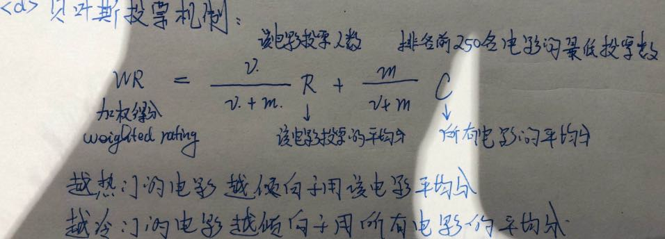
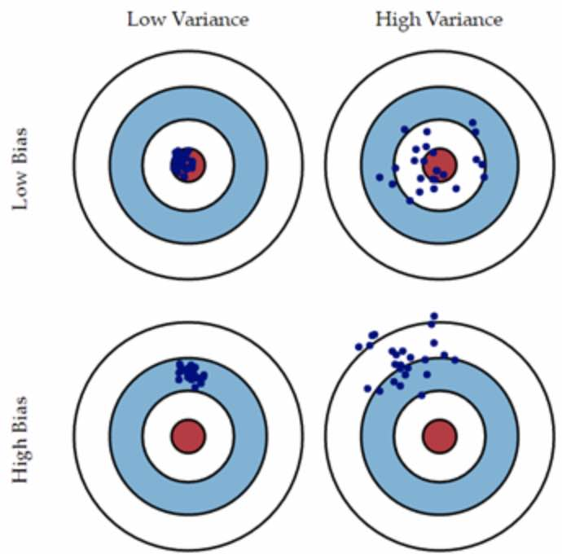

# 集成学习1：Bagging, Random Froests
 
## 1.投票分类器
**硬投票分类器：**弱分类器之间少数服从多数 
**软投票分类器：**每个弱分类器为样本算出类别概率，多个弱分类器取平均 

备注：

* sklearn的voting=“soft”/“hard”超参数可以决定使用哪种投票
* 但如果所分类器包含SVC会比较特殊

	> SVC默认不会输出类别概率；如果设置probability=True超参数强制SVC输出类别概率、会导致SVC使用交叉验证来估算类别概率，减慢训练速度

## 2. 投票机制
* 一票否决 or 一票表决：例如发现某棵树非常重要时
* 少数服从多数（最常用）
* 阈值表决：至少得到多少票；去最高、最低值之后进行表决
* 贝叶斯投票机制：综合热门度和投票票数

## 3. 投票分类器的原理
> 为什么很多准确率不高的弱分类器，通过投票机制之后，可以组合成一个准确率很高的强分类器

**大数定理**：例如51%硬币正面朝上，投掷1000次之后，大多数投掷正面朝上的概率为75%，10000次之后概率为97% 
**前提条件**：所有分类器都是完全独立的，彼此之间的错误毫不相关（实际当中做不到、因为是相同数据训练出来的、可能会犯相同的错误，只能做到尽可能互相独立）

## 4. Bagging和Pasting
为了保证分类器尽量彼此独立，除了使用不同的训练算法，另一种方法是算法相同但是在不同的随机训练子集上训练随机采样得到子集，采样方法有两种 
> **Bagging**：每采完一个样本之后将这个样本放回去再采样下一个（一个样本可能被同一个弱分类器训练使用多次）
> **Pasting**：每采完一个样本之后，不放回，继续采下一个，整个子集采好之后才全部放回（一个样本只能被同一个弱分类器使用一次) 

聚合函数通常是统计方法：分类模型使用投票分类器；而预测模型则使用平均法 
每个分类器因为只用了一部分样本、单独的偏差比使用全部训练集的偏差高(差)一些，但聚合之后，同时降低的偏差和方差。总体来说，集成之后偏差相近，但方差更低 
对决策边界进行可视化，可以发现集成之后，泛化效果会更好，决策边界也更规则

## 5.包外评估（OOB）
对于Bagging来说，因此每个样本采样完会放回去，因此一部分样本会被多次采样到，而另外有一部分样本一次都不会被采样到 
平均情况是，训练每一个弱分类器：63%的样本会被采样(1到多次)用于训练，37%的样本一次都不会被采样到；而这37%的样本正好可以用作测试集 
> Sklearn的oob_score=True超参数可以开启保外评估，通过oob_decision_function_可以知道用于包外评估的样本的预测结果（各个概率的预测分数）

## 6.随机子空间和Random Patch：

在Bagging和Pasting的弱分类器训练过程中，可以使用： 
(1) 随机子空间法：对特征进行抽样 
(2) Random Patch：对特征和样本都进行抽样、即只使用一部分特征、同时也不再从m个样本中采集而只是从其中一部分的样本中进行采集 

在训练弱分类器时使用随机子空间法，为决策树的生长引入了更多的随机性，导致了树的差异性，用更高的偏差换取（这个弱分类器）更低的方差

## 7.极端随机树
与常规随机森林中的随机树不同，极端随机树不再为每个特征搜索最佳分裂阈值、而是使用随机阈值
这样训练出的决策树将更加随机，由它组成的随机森林以更高的偏差换区了更低方差
很难说极端随机森林和常规随机森林哪个效果更高，唯一的方法是各训练一个，然后用交叉验证（也需要使用网格搜索调整参数）进行比较

## 8.随机森林扩展应用
### (1) 计算样本间的相似度
对于N个样本的数据集、用Sn*n矩阵表示相似度。对于m棵决策树组成的随机森林，遍历森林中所有决策树的所有叶子节点，某个节点同时包含样本i,j时，S[i][j]+=1 

### (2) 估算特征的重要性
方法1：根据每个特征在森林中所有树的平均深度计算 （重要的特征距离根节点更近）
> Sklearn提供API来估算特征的重要性  
> 通过随机森林发现特征的重要性之后，可以对其可视化，例如使用灰度图来可视化特征的重要度，进而发现有效的特征

方法2：计算正例经过的节点、数目、gini系数等指标
> 特征被决策树选中的次数  
> 特征被选中时Gini系数变化的情况  
> 把这个特征替换掉，重新训练一颗决策树，计算新模型正确率的变化

### (3) 用Isolation Forest检查连续特征的异常值
> step1：	随机选特征随机选分割点，生成一颗有一定深度的决策树，计算样本x从根到叶子节点的长度f(x)  
> step2：	重复step1一共i次，训练i棵树，计算样本x在i棵树中f(x)总和F(x)  
> step3：	若样本X为异常值，它应当在大多数iTree中很快就从根节点到达叶子节点了，即F(x)比较小

## 9. Variance(方差)和Bias(偏差)

