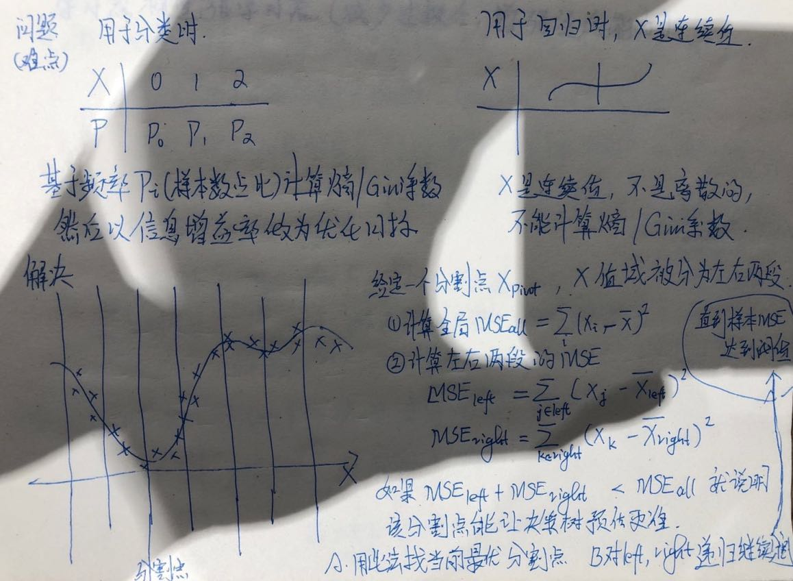

# 决策树

## 1.决策树
支持分类、回归、多输出任务

## 2.决策树训练过程可以可视化
查看每个分类节点的权重数据，如：
> 分类依据、基尼系数、样本总数、细分到下一层各节点的类别和样本数等、该节点的预测类别 （P155）
可视化决策边界（P156）

## 3.预测
**预测类别**：沿着训练好的决策树节点、依次做选择判断、进入下一层节点，直到到达叶节点 
**估算一个样本属于各个类别的概率**：
>* 找到样本所属的叶子节点  
>* 该节点记录了符合该节点的所有样本中，落到各个类别的数量和占比，占比最高的是预测类别，所占百分比是预测概率（如落到叶节点A的训练样本有100个、其中80个数据类别2、20个数据类别3、预测类别是类别2、预测概率是80%）

## 4.节点分类依据
**(1) 基尼不纯度（基尼系数）**：用哪个特征来分裂节点得到的子节点类别最纯（基尼系数最低），就用哪个特征来分裂当前节点
节点i的基尼不纯度(k是类别）
> Gi = 1 - SUM(Pi,k2)  

**(2) 信息熵**：用哪个特征分裂节点得到的子节点信息熵最低（混乱程度最小），就用哪个特征来分裂当前节点
> 节点n的信息熵(i是样本下标、k是类别)：Hn=-SUM(Pi,k * log(Pi,k))   

**(3) 使用基尼不纯度、还是使用信息熵** 
默认使用基尼不纯度，sklearn提供超参数criterion来设置使用信息熵作为分类依据 
大多数情况两者差别不大，基尼不纯度计算更快，信息熵倾向于产出更平衡的树

**(4) 几种决策树使用的分类依据** 

* **ID3**：使用信息增益g(D,A)，根据Ven图、信息增益也等价于互信息I(D,A)
	
	> g(D,A) = H(D) - H(D|A): 表示给定特征A之后数据集D的经验熵下降了多少 
	> I(D,A) = D(P(D,A)||P(D)P(A)) = SUM(P(D,A)* log(P(D,A)/(P(D)*P(A))	表示P(D,A)联合分布与两个独立分布乘积P(D)P(A)的相对熵
	
	缺点是使用信息增益时，取值多的属性更容易使数据更“纯”（即信息增益更大），这样会训练出一颗庞大但是很浅的树，不合理（一个极端的例子：有一个很激进的特征、能把N个样本分成N份，每份只有一个样本，类别单一其熵为0，导致信息增益非常高）

* **CART**：使用基尼系数
* **C4.5**：使用信息增益率 

	> g_r(D,A) = G(D,A) / H(A)  
	> 除以H(A)，解决ID3和CART中偏向于取值多的属性的问题 

## 5.计算复杂度
训练每个节点时，都需要在该节点所有样本上比较所有特征，对小数据集，可以通过对数据做预处理（presort=True）来加速

## 6. 决策树评价函数 、即损失函数
* 损失函数： C(T) = SUM(Nt * H(t)) 
	> 其中t是叶子节点，Nt是叶子节点样本数，H(t)是叶子节点的经验熵

* C(T)越小、说明分类效果越好（有更多叶子节点接近于纯节点(H(t)=0、只有一个类别）
* C(T)越大、说明分类效果不好（有更多叶子节点接近于均节点(H(t)=lnK、该叶子节点的样本均匀落在K个类别中）

## 7. 解决过拟合问题

决策树容易产生过拟合，需要正则化，方法包括：

1. 限制树的深度：树浅欠拟合，树深过拟合，对于随机森林也一样，要用测试集错误率来检查
2. 限制容许节点分裂的最小样本数（避免因为噪点分裂节点） 
3. 限制容许节点分类的最小样本占比（占全局） 
4. 限制最大叶节点数量
5. 分裂前最大评估特征数（分裂每个节点时评估的最大特征数）

	> **预减枝**: 深度>阈值，节点样本数<阈值，熵<阈值时，不再划分 
	> **后减枝**: 比较复杂、一般使用预减枝更多。步骤如下： 
	> a. 生成完整的决策树 
	> b. 不断重复如下过程、每次得到1棵减枝后的决策树、直到减到只有1个节点：重复次数记为K 
	> * 计算上一轮减出来的树Tk-1所有内部结点的减枝系数ɑ 
	> * 减去ɑ最小的内部节点，得到新的树Tk 
	> * 计算Tk的评价系数C(Tk)=SUM(Nt,k* H(Tk)) 
	> c. 从剪出来的K棵树中选C(Tk)最小的

## 8.决策树用于回归
原理与决策树用作分类类似，差别是不再预测一个类别，而是预测一个数值 
分裂依据不再是最小化基尼不纯度或者信息熵，而是最小化均方根误差(MSE) 
可视化时输出的是：分类依据、MSE、样本数、目标预测值 
与用于分类一样，同样需要正则化以预防过拟合 


## 9.决策树的不稳定性
(1) 对训练集旋转非常敏感，倾向于按照正交边界进行分裂，可以试一下PCA 
(2) 对训练数据中的小变化非常敏感 
(3) 算法是随机的，即使相同的训练数据上也会得到完全不同的数据（除非对超参数random_state进行设置）
> 使用随机森林，通过对许多棵树的预测进行平均，可以限制这种不稳定性（根据大数定理）
