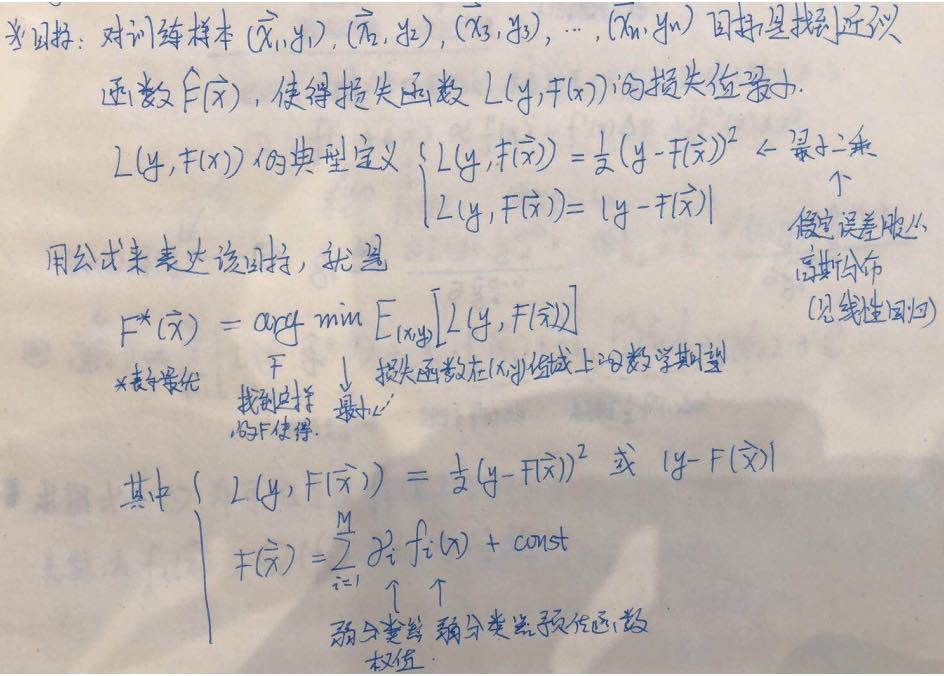
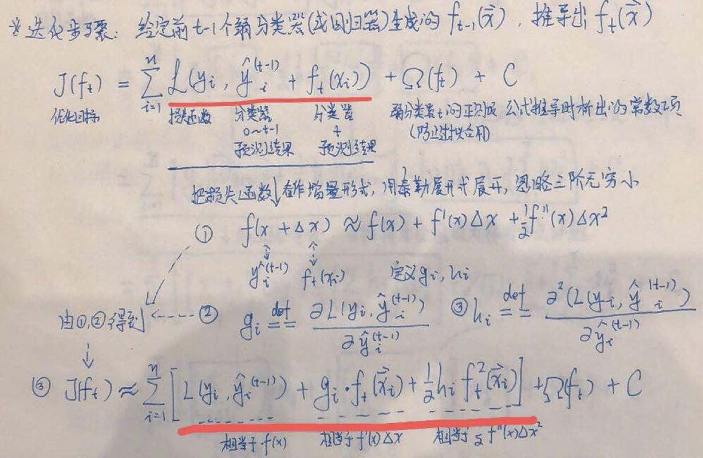
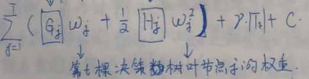
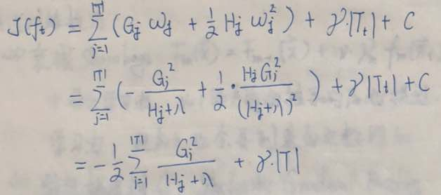
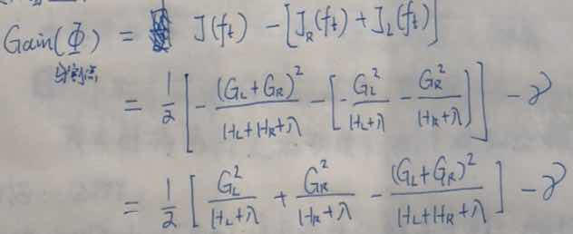
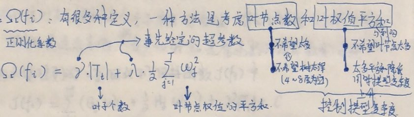
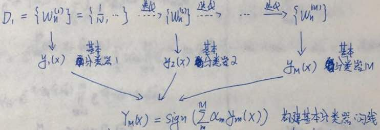
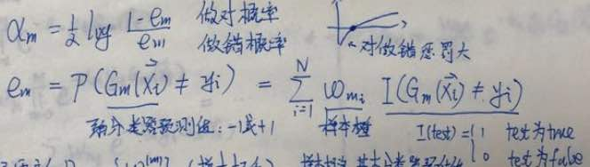
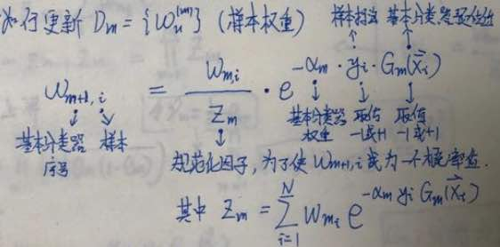

# 集成学习2: Boosting

## 1. Bagging与Boosting
**Bagging**:

* 是减少训练方差(Variance)的技术，用Bagging的方法重采样，每次采到的样本不同训练出的子模型也不同
* 虽然这些模型都存在一定的欠拟合(高Variance)，但根据大数定理，当用投票的方式继承在一起时，整体的拟合能力将得到提高
* 随机森林中的m棵子树互相独立，相互之间没有关系

**Boosting**:	

* 是减少训练偏差(Bias)的技术，能够在泛化能力较弱的学习器基础上进行训练，构造出强学习器
* 将几个弱学习器结合成一个强学习器，总体思路是循环训练，每次都对其前序做一些改进
* 用Boosting集成起来的第M棵树，用了前M-1棵树的信息

## 2. Boosting

要训练的弱分类器：F(x)  
要训练的弱分类器集成公式：M(X)  
训练依据：给决策树设计损失函数L(y, M(x))来训练下一棵决策树 
如何让F(x)及其参数沿着损失函数方向收敛： 

* 方法1	(XGBoost, GBDT) 使用: 	残差训练、每一个弱分类器都沿着损失函数梯度的方向进行训练	
* 方法2	(AdaBoost)：	前一轮分错的样本被调高权重，同时根据每一轮分类的效果来给每棵决策树设计一个权重

## 3. XGBoost原理及推导
起始：F0(X)=C，其中C是样本Y值的中位数 
迭代：对于第i个弱分类器Fi(X) 

1. Fi(X)预测目标是残差，即样本标签(Y)与前i-1个分类器集成预测结果的差值 
2. i个模型集成，损失函数可以用泰勒展开式展开（其中模型i预测结果体现在X增量中，XGBoost使用的是二阶展开式，GBDT使用的是一阶展开式) 
 
3. 假定第i棵决策树的结构已经得到、一共有t个叶节点，权重依次为w1,…,wt，定义fi(x)=wq(x)，即弱分类器对样本x的预测结果等于叶节点q(X)的权值（接下来先算出w1, …, wt的值，然后再推导决策树的结构) 
4. 带入fi(X) = wq(x)，对目标函数进行推导，忽略与求最小损失值无关的项，最终可表示为第i棵树叶节点数|Ti|和叶节点权值wj 
 
5. 求解wj：对目标函数关于wj求偏导，让目标函数取最小值，就可以解出所有叶节点的权值wj 
6. 对于整个决策树，将wj回代到上面图片中的损失函数中，可计算整棵树的损失值 
 
7. 同理对于任意一部分叶节点组成的子树，也可以带入属于子树的那部分叶节点权重wj，计算子树的损失值 
8. 因此，对于决策树任意一个分割点，会将一批叶节点，分割成两部分，分别计算分割前后的损失值，就能计算出信息增益 
 
9. 枚举所有分割点，计算信息增益，选增益最大的点进行分割 
10. 重复上一步、递归分割各棵子树，直到信息增益小于阈值，或者遇到了纯节点，停止当前递归分支上的分割 
11. 至此，第i课子树的结构也已经得到

## 4. XGBoost正则项
正则项加在优化目标中，优化目标为损失值+正则项+常数 
 
正则项计算方法例如：限制叶节点个数；限制叶节点权值(等于预测值)的平方和(希望返回较大预测值的叶节点数目不要太多)。通过正则项模型的复杂度得到限制 
 

## 5. XGBoost的Predict Function
Fm(Xi) = Fm-1(Xi) + α * ymfm(Xi) 
> Xi是样本i 
> α是学习率，α=1即为上面的XGBoost模型例子，一般α=0.1从而起到衰减效果 
> ym是子树的权重参数，前面推导中未出现

## 6. XGBoost调参
1. 调整正则项超参数，对复杂模型增加惩罚项（如模型复杂程度正比于叶节点数目，或叶节点预测值(fi(X) = wq(X))的平方和 
2. 叶节点的数目控制了子树的层数，一般来说子树层数控制在[4,8]范围内比较好 
3. 叶节点包含最少样本数限制：防止出现过小叶节点、降低预测方差 
4. 梯度提升迭代次数M：增加M可降低训练集loss值、但有过拟合风险 
5. 在predict function给一个v<1的衰减率，一般推荐v<0.1，这样训练残差的子树权重会越来越低，减小过拟合风险 
6. Stochastic Gradint Boosting：每次迭代下一个新子树采用无回放降采样，即只使用占比f (f<1，推荐f∈(0.5,0.8)）的样本，较小的f使得新子树的随机性增强，防止过拟合收敛更快，同时剩余的样本可以做模型验证 

## 7. XGBoost与GBDT
GBDT使用一阶导数进行学习(与XGBoost不同)，它是GBDT(GBM)的一个C++实现 
XGBoost使用二阶导信息，收敛更快，XGBoost属于“随机森林族"具有抗过拟合优势，使用了并行、多核计算，速度更快

## 8.AdaBoost（自适应提升法, Adaptive Boosting）原理
**方法**：对N个样本，每个样本一个权重（处始权重都是1/N），每一轮迭代训练一个子分类器 

* 在第i轮迭代时：如果分错、在第i+1轮迭代时、该样本权重就会被调高，因此之前分错的样本可以得到更多的重视
* 在第i轮迭代完成后：第i个子分类器训练完成，同时这个子分类器也会得到一个权重

子分类器通过线性组合方式被集成 
 
计算子模型i的权重：αi = log((1-errorm)/errorm)即“分对的样本数/分错的样本数”取对数，对数使得分错样本的惩罚增加 
 
更新样本权重：考虑因素包括（1）前一个子分类器权重（2）前一个子分类器给这个样本的权重（3）前一个子分类器分对还是分错，分类正确时标签*预估类别乘积为1，错误时乘积为-1 
 
分子只考察当前子分类器在样本i上的表现；分母上规范化因子体现所有（已训练好的）子分类器在样本i上的表现；分子/分母得到的是一个概率 
把样本权重作为e的指数，该方法与softmax中使用的相同，因为不改变值的顺序，效果上是等价的
附：AdaBoost误差上线，只要子分类器的误差<0.5，就可以通过AdaBoost来让集成后的误差下降（推导过程见Appendix)

## 10.AdaBoost：sklearn透明支持多分类预测
不要求输出预测类别概率时，sklearn使用SAMME版本的AdaBoost，支持二分类和多分类 
要求输出预测类别概率时，sklearn使用SAMME.R版本的AdaBoost (R代表Real) 

## 12.基于梯度提升的Boosting：GBRT（梯度提升回归树）
原理：残差学习，每个弱预测器对*前一个*预测器的残差进行拟合 
代码：GradientBoostingRegressor

* 集成到GBRT的决策树，也可以使用控制过拟合的超参数  
* 超参数learning_rate对每棵树的贡献进行缩放
* 可以通过测试集误差来使用早期停止法，来找到树的最优数量

## 13. 堆叠法（Staking）
**原理**：与其像AdaBoost和GBRT那样，用简单的公式来集成弱分类器，为什么不训练一个模型（混合器）来做这件事呢 
**留存集**：训练底层模型时，要留出来一些样本（这些样本底层模型不会见到），来训练高层的混合器 
**训练方法**：将留存集的样本喂给底层模型做预测，预测结果用做高层模型的输入 

